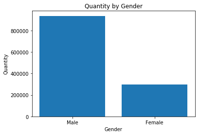
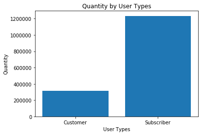

# Project 01 - Explore Chicago Bikeshare Data

#### Tags
* Title: Project 01 - Explore Chicago Bikeshare Data
* Author: AH Uyekita
* Course: Data Science - Foundation 01
* Date: 08/12/2018
* Cod: ND110
* Tags: Udacity, Data Science, Python

## Objectivies

This is my first `Jupyter Notebook`, so this is an opportunity to learn how this tool works. It's quite familiar with `RMarkdown` files.

My objectivies to this document:

* Pratice the Jupyter Notebook;
* Documentation of my project;
* Turn this document reproducible;
* Have fun.

## Synopsis

All this document is about the Project of the Nanodegree ND110 called Explore Chicago Bikeshare Data, but the real core of this project is to fill some chuncks of code in a skeleton/template of py file.


## Requirements

The code will use the UTF-8 encoding system, and the libraries to perform this project:


```python
# Here goes the imports
import csv
import matplotlib.pyplot as plt
```

The csv package is used to import a csv file (chicago.csv) and the matplotlib is applied to plot simple graphics.

### Environment

I have tested a bunch of softwares to run the python scripts, such as:

* Spider
* IDLE
* Git Bash

I have also used the CodeSkulptor to test minor things.

* [CodeSkulptor](https://py3.codeskulptor.org/). (I realized this is not a good option to study because sometimes the results is not correctly.)

Lastly, my all purpose `py` file editor is the Atom.

* Atom.

> Obs.: The best way I found out (in three days coding in Python) was: Atom + Git Bash. I'm sure I'll change it, but it good to point it out.

## Loading data


```python
# Let's read the data as a list
print("Reading the document...")
with open("chicago.csv", "r") as file_read:
    reader = csv.reader(file_read)
    data_list = list(reader)
print("Ok!")
```

    Reading the document...
    Ok!
    

## Some Analysis

Let's check the number of rows and the number of column.


```python
print("Number of rows:")
print(len(data_list))
print("Number of column:")
print(len(data_list[0]))
```

    Number of rows:
    1551506
    Number of column:
    8
    

Accordlying with the **Project Details** there are six (6) columns, but this is clearly a mistake. Now, let's print the first row of this dataset, which I expect the headers of the document:


```python
# Printing the first row of data_list to check if it worked.
print("Row 0: ")
print(data_list[0])
# It's the data header, so we can identify the columns.
```

    Row 0: 
    ['Start Time', 'End Time', 'Trip Duration', 'Start Station', 'End Station', 'User Type', 'Gender', 'Birth Year']
    

So, the data starts from the second line, let's take a look.


```python
# Printing the second row of data_list, it should contain some data
print("Row 1: ")
print(data_list[1])
```

    Row 1: 
    ['2017-01-01 00:00:36', '2017-01-01 00:06:32', '356', 'Canal St & Taylor St', 'Canal St & Monroe St (*)', 'Customer', '', '']
    

## Task

This `py` skeleton of script has twelve (12) chunks to be complete with code. I will describe each chunck with details (to remember in 6 months what I have done) in this project.

### Task 1

>TODO: Print the first 20 rows using a loop to identify the data.

**First solution:**
```
for i in range(0,20):
    print(data_list[i])
```
Each element of this list represent a single row of the dataset chicago.csv, for this reason, I just need to `print()` the first 20 rows using a `for()`, but I minded that Python is a _zero-index_ programming language. The `range()` functions allows me to iterate from 0 to 19 (the `range()` function has the first argument inclusive and the second argument exclusive).

In the first revision, the reviewer adviced me to change a little bit my code. He said to turn my code more "Pythonic".

**Final solution**
```
for row in data_list[:20]:   # The first 20 rows - The first row in the header and the other 19 rows were observations
    print(row)                # Printing
```


```python
print("\n\nTASK 1: Printing the first 20 samples")

for row in data_list[:20]:   # The first 20 rows - The first row in the header and the other 19 rows were observations
    print(row)                # Printing

# Let's change the data_list to remove the header from it.
data_list = data_list[1:]

# We can access the features through index
# E.g. sample[6] to print gender or sample[-2]
```

    
    
    TASK 1: Printing the first 20 samples
    ['Start Time', 'End Time', 'Trip Duration', 'Start Station', 'End Station', 'User Type', 'Gender', 'Birth Year']
    ['2017-01-01 00:00:36', '2017-01-01 00:06:32', '356', 'Canal St & Taylor St', 'Canal St & Monroe St (*)', 'Customer', '', '']
    ['2017-01-01 00:02:54', '2017-01-01 00:08:21', '327', 'Larrabee St & Menomonee St', 'Sheffield Ave & Kingsbury St', 'Subscriber', 'Male', '1984.0']
    ['2017-01-01 00:06:06', '2017-01-01 00:18:31', '745', 'Orleans St & Chestnut St (NEXT Apts)', 'Ashland Ave & Blackhawk St', 'Subscriber', 'Male', '1985.0']
    ['2017-01-01 00:07:28', '2017-01-01 00:12:51', '323', 'Franklin St & Monroe St', 'Clinton St & Tilden St', 'Subscriber', 'Male', '1990.0']
    ['2017-01-01 00:07:57', '2017-01-01 00:20:53', '776', 'Broadway & Barry Ave', 'Sedgwick St & North Ave', 'Subscriber', 'Male', '1990.0']
    ['2017-01-01 00:10:44', '2017-01-01 00:21:27', '643', 'State St & Kinzie St', 'Wells St & Polk St', 'Subscriber', 'Male', '1970.0']
    ['2017-01-01 00:11:34', '2017-01-01 00:23:47', '733', 'Wabash Ave & Wacker Pl', 'Clinton St & Tilden St', 'Subscriber', 'Male', '1986.0']
    ['2017-01-01 00:14:57', '2017-01-01 00:26:22', '685', 'Daley Center Plaza', 'Canal St & Monroe St (*)', 'Customer', '', '']
    ['2017-01-01 00:15:03', '2017-01-01 00:26:28', '685', 'Daley Center Plaza', 'Canal St & Monroe St (*)', 'Customer', '', '']
    ['2017-01-01 00:17:01', '2017-01-01 00:29:49', '768', 'Dayton St & North Ave', 'Ogden Ave & Chicago Ave', 'Customer', '', '']
    ['2017-01-01 00:17:13', '2017-01-01 11:03:34', '38781', 'Wilton Ave & Diversey Pkwy', 'Halsted St & Wrightwood Ave', 'Subscriber', 'Female', '1988.0']
    ['2017-01-01 00:18:28', '2017-01-01 00:31:05', '757', 'Canal St & Madison St', 'LaSalle St & Illinois St', 'Customer', '', '']
    ['2017-01-01 00:18:50', '2017-01-01 00:21:47', '177', 'Theater on the Lake', 'Lakeview Ave & Fullerton Pkwy', 'Subscriber', 'Male', '1991.0']
    ['2017-01-01 00:23:41', '2017-01-01 00:29:13', '332', 'Halsted St & Maxwell St', 'Halsted St & 18th St', 'Subscriber', 'Male', '1984.0']
    ['2017-01-01 00:25:47', '2017-01-01 00:39:53', '846', 'Ravenswood Ave & Lawrence Ave', 'Clarendon Ave & Gordon Ter', 'Subscriber', 'Female', '1987.0']
    ['2017-01-01 00:25:47', '2017-01-01 00:43:23', '1056', 'Clark St & Congress Pkwy', 'Wolcott Ave & Polk St', 'Subscriber', 'Male', '1984.0']
    ['2017-01-01 00:26:21', '2017-01-01 00:39:40', '799', 'Ravenswood Ave & Lawrence Ave', 'Clarendon Ave & Gordon Ter', 'Subscriber', 'Male', '1987.0']
    ['2017-01-01 00:27:21', '2017-01-01 00:42:59', '938', 'Millennium Park', 'Michigan Ave & 18th St', 'Subscriber', 'Male', '1991.0']
    ['2017-01-01 00:27:28', '2017-01-01 00:42:44', '916', 'Millennium Park', 'Michigan Ave & 18th St', 'Subscriber', 'Female', '1990.0']
    

### Task 2

>TODO: Print the `gender` of the first 20 rows.

All `list` are ordered and for this reason I can use the index to pick the exactly element inside of that list.

**First solution:**
```
for i in range(0,20):        # The first 20 rows
    print(data_list[i][6])   # Subsetting each row gathering the 7th element of this list and print
                             # I could also use data_list[i][-2]
```

Due to a lack of descriptive names in my code, the reviewer also said to make an effort to turn this more readable.

**Final solution:**
```
for row in range(0,20):       # The first 20 rows
    print(data_list[row][6])  # The second index 6 means gender's column
```
Following the structions I convert it to a "Pythonic" way.


```python
print("\nTASK 2: Printing the genders of the first 20 samples")

for row in data_list[:20]:       # The first 20 rows
    print(row[6])                # The second index 6 means gender's column

# Cool! We can get the rows(samples) iterating with a for and the columns(features) by index.
# But it's still hard to get a column in a list. Example: List with all genders
```

    
    TASK 2: Printing the genders of the first 20 samples
    
    Male
    Male
    Male
    Male
    Male
    Male
    
    
    
    Female
    
    Male
    Male
    Female
    Male
    Male
    Male
    Female
    Male
    

### Task 3

>TODO: Create a function to add the columns(features) of a list in another list in the same order

For this Task I have also updated my code to turn it more Pythonic also, although it was correctly.

**Final solution:**

```
def column_to_list(data, column):
    """
    -----------------------------------------------------------------------------------------------------
    |DESCRIPTION:                                                                                       |
    |                                                                                                   |
    |     This function selects a specific column (defined as column) of a data frame (here called      |
    |     as data, but probabily will be data_list).                                                    |
    |                                                                                                   |
    -----------------------------------------------------------------------------------------------------
    |INPUT:                                                                                             |
    |                                                                                                   |
    |     VARIABLE   TYPE   DESCRIPTION                                                                 |
    |                                                                                                   |
    |     data       list   The imported dataset of the Chicago Bikeshare, a 1551506 x 8 data frame     |
    |                       stored in a list.                                                           |
    |                                                                                                   |
    |     column     int    The desireable column to be selected.                                       |
    |                           0: Start Time                                                           |
    |                           1: End Time                                                             |
    |                           2: Trip Duration                                                        |
    |                           3: Start Station                                                        |
    |                           4: End Station                                                          |
    |                           5: User Type                                                            |
    |                           6: Gender                                                               |
    |                           7: Birth Year                                                           |
    |                                                                                                   |
    -----------------------------------------------------------------------------------------------------
    |OUTPUT:                                                                                            |
    |                                                                                                   |
    |     VARIABLE      TYPE   DESCRIPTION                                                              |
    |                                                                                                   |
    |     column_list   list   The Selected column from the data input.                                 |
    |                                                                                                   |
    -----------------------------------------------------------------------------------------------------
    """
    column_list = [] # Local variable
    
    # Tip: You can use a for to iterate over the samples, get the feature by index and append into a list
    for row in data:                     # Iterates each row of data
        column_list.append(row[column])  # select a specific element (column) of the row and append it
    return column_list                   # Now in "Pythonic" way.

```
I followed the instruction and created a `for()` loop and for each element of the input called data I appended to the local variable column_list, which will be returned as output.


```python
def column_to_list(data, column):
    """
    -----------------------------------------------------------------------------------------------------
    |DESCRIPTION:                                                                                       |
    |                                                                                                   |
    |     This function selects a specific column (defined as index) of a data frame (here called       |
    |     as data, but probabily will be data_list).                                                    |
    |                                                                                                   |
    -----------------------------------------------------------------------------------------------------
    |INPUT:                                                                                             |
    |                                                                                                   |
    |     VARIABLE   TYPE   DESCRIPTION                                                                 |
    |                                                                                                   |
    |     data       list   The imported dataset of the Chicago Bikeshare, a 1551506 x 8 data frame     |
    |                       stored in a list.                                                           |
    |                                                                                                   |
    |     index      int    The desireable column to be selected.                                       |
    |                           0: Start Time                                                           |
    |                           1: End Time                                                             |
    |                           2: Trip Duration                                                        |
    |                           3: Start Station                                                        |
    |                           4: End Station                                                          |
    |                           5: User Type                                                            |
    |                           6: Gender                                                               |
    |                           7: Birth Year                                                           |
    |                                                                                                   |
    -----------------------------------------------------------------------------------------------------
    |OUTPUT:                                                                                            |
    |                                                                                                   |
    |     VARIABLE      TYPE   DESCRIPTION                                                              |
    |                                                                                                   |
    |     column_list   list   The Selected column from the data input.                                 |
    |                                                                                                   |
    -----------------------------------------------------------------------------------------------------
    """
    column_list = []
    # Tip: You can use a for to iterate over the samples, get the feature by index and append into a list
    for row in data:                     # Iterates each row of data
        column_list.append(row[column])  # select a specific element (column) of the row and append it
    return column_list                   # Now in "Pythonic" way.


# Let's check with the genders if it's working (only the first 20)
print("\nTASK 3: Printing the list of genders of the first 20 samples")
print(column_to_list(data_list, -2)[:20])
```

    
    TASK 3: Printing the list of genders of the first 20 samples
    ['', 'Male', 'Male', 'Male', 'Male', 'Male', 'Male', '', '', '', 'Female', '', 'Male', 'Male', 'Female', 'Male', 'Male', 'Male', 'Female', 'Male']
    

I have created an axuliary function to perform the summation, the reviewer said to do not use the built-in function. So I need to code my own codes.


```python
def sum_ahu(my_list):
    """
    -----------------------------------------------------------------------------------------------------
    |DESCRIPTION:                                                                                       |
    |                                                                                                   |
    |     This function perform the summationof a given list.                                           |
    |                                                                                                   |
    -----------------------------------------------------------------------------------------------------
    |INPUT:                                                                                             |
    |                                                                                                   |
    |     VARIABLE   TYPE   DESCRIPTION                                                                 |
    |                                                                                                   |
    |     my_list    list   A list of integer or float.                                                 |
    |                                                                                                   |                                                                                                   |
    -----------------------------------------------------------------------------------------------------
    |OUTPUT:                                                                                            |
    |                                                                                                   |
    |     VARIABLE     TYPE    DESCRIPTION                                                              |
    |                                                                                                   |
    |     summation    float   I decided to return a float to avoid a loss of information.              |
    |                                                                                                   |
    -----------------------------------------------------------------------------------------------------
    """
    summation = 0 # Local variable to be updated in each iteration
    
    for index in range(0,len(my_list)):        # Loop used to "visit" each element of the list.
        summation += float(my_list[index])     # Accumulating the values and updating the summation.
            
    return summation # Return the summation
```

### Task 4

>TODO: Count each gender. You should not use a function to do that.

I have only changed the function `sum()` to `sum_ahu()`.

**My solution:**
```
gender = column_to_list(data_list, -2) # Selecting the Gender's column of data_list dataframe.

# Lambda Expressions
is_male = lambda x : x == "Male"     # Check each how if the statment is True or False. Later I will coerce
is_female = lambda x : x == "Female" # True to 1 and False to 0 to count the number of each category.
is_blank = lambda x : x == ""        # I used the plt.hist(gender) function to find out the categories of
                                     # Gender's column.

male = sum_ahu(list(map(is_male, gender)))        # Applying map() (for each column) and lambdas functions
female = sum_ahu(list(map(is_female, gender)))    # I could count the number of each category. 
undefined = sum_ahu(list(map(is_blank, gender)))  # Obs.: I "coerced" boolean to integer by the using of sum().
```
I figure out how to use the functions `map()` and the new concept learnt called _lambda expression_, binding these two concepts I realized I could you those two together in a very straightforward way.

* Lambda expressions to evaluate a simple statement (equal to "Male");
* `map()` to apply the lambda expression in all elements of a given list;
* "Coercing" the boolean values to `int` and later summing the values.

Keep in mind that there are 3 categories to gender variable:

* Male
* Female
* Blank

I have check this using the `set()` function to select the unique values of gender.
```
print(set(gender)) # Print the unique values/categories of gender
```


```python
gender = column_to_list(data_list, -2) # Selecting the Gender's column of data_list dataframe.

# Lambda Expressions
is_male = lambda x : x == "Male"     # Check each how if the statment is True or False. Later I will coerce
is_female = lambda x : x == "Female" # True to 1 and False to 0 to count the number of each category.
is_blank = lambda x : x == ""        # I used the plt.hist(gender) function to find out the categories of
                                     # Gender's column.

male = sum(list(map(is_male, gender)))        # Applying map() (for each column) and lambdas functions
female = sum(list(map(is_female, gender)))    # I could count the number of each category. 
undefined = sum(list(map(is_blank, gender)))  # Obs.: I "coerced" boolean to integer by the using of sum().

# Checking the result
print("\nTASK 4: Printing how many males and females we found")
print("Male: ", male, "\nFemale: ", female)
```

    
    TASK 4: Printing how many males and females we found
    Male:  935854 
    Female:  298784
    

### Task 5

> TODO: Create a function to count the genders. Return a list

> Should return a list with [count_male, counf_female] (e.g., [10, 15] means 10 Males, 15 Females)

I also have changed the built-in function `sum` to my `sum_ahu`.

**My solution:**
```
def count_gender(data_list):
    """
    -----------------------------------------------------------------------------------------------------
    |DESCRIPTION:                                                                                       |
    |                                                                                                   |
    |     This function counts the number of "Male" and "Female" from the Gender column of the          |
    |     data_list. This is a specific function to be used only to the purpose to calculated the       |
    |     quantity of "Male" and "Female".                                                              |
    |                                                                                                   |
    -----------------------------------------------------------------------------------------------------
    |INPUT:                                                                                             |
    |                                                                                                   |
    |     VARIABLE   TYPE   DESCRIPTION                                                                 |
    |                                                                                                   |
    |     data_list  list   The list generated after the .read() process. The original file was the     |
    |                       chicago.csv, which has a 1551506 rows and 8 columns.                        |
    |                                                                                                   |
    -----------------------------------------------------------------------------------------------------
    |OUTPUT:                                                                                            |
    |                                                                                                   |
    |     VARIABLE         TYPE   DESCRIPTION                                                           |
    |                                                                                                   |
    |     [male,female]    list   A list of two variables, the first one summarize the number of "Male" |
    |                             the second one summarize the number of "Female".                      |
    |                                                                                                   |
    -----------------------------------------------------------------------------------------------------
    |REQUIREMENT:                                                                                       |
    |                                                                                                   |
    |     NAME             SCOPE                                                                        |
    |                                                                                                   |
    |     column_to_list   Global                                                                       |
    |                                                                                                   |
    -----------------------------------------------------------------------------------------------------    
    """
    # Selecting the Gender's column as a local variable.
    local_gender = column_to_list(data_list, -2) # Keep in mind this function has defined in the Task 3.
    
    # Based on the map() to find True or False and sum() to count.
    male = sum_ahu(list(map(lambda x : x == "Male", local_gender)))     # Simplified version, now with one step less
    female = sum_ahu(list(map(lambda x : x == "Female", local_gender))) # It's a bit clumsy but understandable.
    
    return [male, female] # Return of the total number of male and female.

```
Unfortunately, this function is not a all purpose because it is tailored to work only with the gender column. Take a look to the "Male" and "Female" strings defined in the code.


```python
def count_gender(data_list):
    """
    -----------------------------------------------------------------------------------------------------
    |DESCRIPTION:                                                                                       |
    |                                                                                                   |
    |     This function counts the number of "Male" and "Female" from the Gender column of the          |
    |     data_list. This is a specific function to be used only to the purpose to calculated the       |
    |     quantity of "Male" and "Female".                                                              |
    |                                                                                                   |
    -----------------------------------------------------------------------------------------------------
    |INPUT:                                                                                             |
    |                                                                                                   |
    |     VARIABLE   TYPE   DESCRIPTION                                                                 |
    |                                                                                                   |
    |     data_list  list   The list generated after the .read() process. The original file was the     |
    |                       chicago.csv, which has a 1551506 rows and 8 columns.                        |
    |                                                                                                   |                                                                                                   |
    -----------------------------------------------------------------------------------------------------
    |OUTPUT:                                                                                            |
    |                                                                                                   |
    |     VARIABLE         TYPE   DESCRIPTION                                                           |
    |                                                                                                   |
    |     [male,female]    list   A list of two variables, the first one summarize the number of "Male" |
    |                             the second one summarize the number of "Female".                      |
    |                                                                                                   |
    -----------------------------------------------------------------------------------------------------
    |REQUIREMENT:                                                                                       |
    |                                                                                                   |
    |     NAME             SCOPE                                                                        |
    |                                                                                                   |
    |     column_to_list   Global                                                                       |
    |                                                                                                   |
    -----------------------------------------------------------------------------------------------------    
    """
    # Selecting the Gender's column as a local variable.
    local_gender = column_to_list(data_list, -2) # Keep in mind this function has defined in the Task 3.
    
    # Based on the map() to find True or False and sum() to count.
    male = sum_ahu(list(map(lambda x : x == "Male", local_gender)))     # Simplified version, now with one step less
    female = sum_ahu(list(map(lambda x : x == "Female", local_gender))) # It's a bit clumsy but understandable.
    
    return [male, female] # Return of the total number of male and female.


print("\nTASK 5: Printing result of count_gender")
print(count_gender(data_list))
```

    
    TASK 5: Printing result of count_gender
    [935854.0, 298784.0]
    

### Task 6

>TODO: Create a function to get the most popular gender and print the gender as string.

> We expect to see "Male", "Female" or "Equal" as answer.

```
def most_popular_gender(data_list):
    """
    -----------------------------------------------------------------------------------------------------
    |DESCRIPTION:                                                                                       |
    |                                                                                                   |
    |     This function returns which Gender has the majority of in case of the same number returned    |
    |     Equal                                                                                         |
    |                                                                                                   |
    -----------------------------------------------------------------------------------------------------
    |INPUT:                                                                                             |
    |                                                                                                   |
    |     VARIABLE   TYPE   DESCRIPTION                                                                 |
    |                                                                                                   |
    |     data_list  list   The list generated after the .read() process. The original file was the     |
    |                       chicago.csv, which has a 1551506 rows and 8 columns.                        |
    |                                                                                                   |
    -----------------------------------------------------------------------------------------------------
    |OUTPUT:                                                                                            |
    |                                                                                                   |
    |     VARIABLE   TYPE   DESCRIPTION                                                                 |
    |                                                                                                   |
    |     answer     str    If the number of "Name" are greater than "Female" return "Male". If the     |
    |                       opposite was true returns "Female". In cases of draw return "Equal".        |
    |                                                                                                   |
    -----------------------------------------------------------------------------------------------------
    |REQUIREMENT:                                                                                       |
    |                                                                                                   |
    |     NAME             SCOPE                                                                        |
    |                                                                                                   |
    |     count_gender     Global                                                                       |
    |                                                                                                   |
    ----------------------------------------------------------------------------------------------------- 
    """
    # Number of Male and Female calculationg
    local_gender_total = count_gender(data_list) # local_gender_total[0] : Male
                                                 # local_gender_total[1] : Female

    if local_gender_total[0] > local_gender_total[1]:    # Is Male > Female?
        answer = "Male"                                  # If True update answer
        
    elif local_gender_total[0] == local_gender_total[1]: # Is Male == Female?
        answer = "Equal"                                 # If True update answer
        
    else:                                                # Is Female > Male
        answer = "Female"                                # If True update answer
        
    return answer # Return the answer
```
This is an conditional statement function that will return which gender has the majority.


```python
def most_popular_gender(data_list):
    """
    -----------------------------------------------------------------------------------------------------
    |DESCRIPTION:                                                                                       |
    |                                                                                                   |
    |     This function returns which Gender has the majority of in case of the same number returned    |
    |     Equal                                                                                         |
    |                                                                                                   |
    -----------------------------------------------------------------------------------------------------
    |INPUT:                                                                                             |
    |                                                                                                   |
    |     VARIABLE   TYPE   DESCRIPTION                                                                 |
    |                                                                                                   |
    |     data_list  list   The list generated after the .read() process. The original file was the     |
    |                       chicago.csv, which has a 1551506 rows and 8 columns.                        |
    |                                                                                                   |
    -----------------------------------------------------------------------------------------------------
    |OUTPUT:                                                                                            |
    |                                                                                                   |
    |     VARIABLE   TYPE   DESCRIPTION                                                                 |
    |                                                                                                   |
    |     answer     str    If the number of "Name" are greater than "Female" return "Male". If the     |
    |                       opposite was true returns "Female". In cases of draw return "Equal".        |
    |                                                                                                   |
    -----------------------------------------------------------------------------------------------------
    |REQUIREMENT:                                                                                       |
    |                                                                                                   |
    |     NAME             SCOPE                                                                        |
    |                                                                                                   |
    |     count_gender     Global                                                                       |
    |                                                                                                   |
    ----------------------------------------------------------------------------------------------------- 
    """
    # Number of Male and Female calculationg
    local_gender_total = count_gender(data_list) # local_gender_total[0] : Male
                                                 # local_gender_total[1] : Female

    if local_gender_total[0] > local_gender_total[1]:    # Is Male > Female?
        answer = "Male"                                  # If True update answer
        
    elif local_gender_total[0] == local_gender_total[1]: # Is Male == Female?
        answer = "Equal"                                 # If True update answer
        
    else:                                                # Is Female > Male
        answer = "Female"                                # If True update answer
        
    return answer # Return the answer

print("\nTASK 6: Which one is the most popular gender?")
print("Most popular gender is: ", most_popular_gender(data_list))
```

    
    TASK 6: Which one is the most popular gender?
    Most popular gender is:  Male
    

If it's everything running as expected, check this graph!

The same case of the summation. I will use this function a bunch of times, to save lines codes I decide to write an auxiliary function.


```python
def count_ahu(my_list):
    """
    -----------------------------------------------------------------------------------------------------
    |DESCRIPTION:                                                                                       |
    |                                                                                                   |
    |     Counts the number of elements of a list. It is the same of len() function.                    |
    |                                                                                                   |
    -----------------------------------------------------------------------------------------------------
    |INPUT:                                                                                             |
    |                                                                                                   |
    |     VARIABLE   TYPE   DESCRIPTION                                                                 |
    |                                                                                                   |
    |     my_list    list   Any list.                                                                   |
    |                                                                                                   |
    -----------------------------------------------------------------------------------------------------
    |OUTPUT:                                                                                            |
    |                                                                                                   |
    |     VARIABLE   TYPE   DESCRIPTION                                                                 |
    |                                                                                                   |
    |     counter    int    The number of elements of a list.                                           |
    |                                                                                                   |
    -----------------------------------------------------------------------------------------------------
    """
    counter = 0 # Set the counter to zero.
    
    for element in my_list:  # Loop the list to be count
        counter += 1             # For each element add 1 to the counter

    return int(counter)          # Return the counter and ensure to be a integer.
```


```python
gender_list = column_to_list(data_list, -2)
types = ["Male", "Female"]
quantity = count_gender(data_list)
y_pos = list(range(len(types)))
plt.bar(y_pos, quantity)
plt.ylabel('Quantity')
plt.xlabel('Gender')
plt.xticks(y_pos, types)
plt.title('Quantity by Gender')
plt.show(block=True)
```





### Task 7

>TODO: Plot a similar graph for user_types. Make sure the legend is correct.

```
# Selecting the desired column
user_types = column_to_list(data_list, -3)

# Selecting the uniques categories.
types = list(set(user_types))  # Three categories: Customer, Dependent and Subscriber

# Removing the "Dependent" as commented above
types = [sorted(types)[0], sorted(types)[-1]]

# Calculating the quantity of each of types ("Customer" and "Subscriber")
quantity = [sum_ahu(list(map(lambda x : x == types[0], user_types))),  # Due to the Task 5 requirements my function
            sum_ahu(list(map(lambda x : x == types[1], user_types)))]  # count_gender() is very specific and can not
                                                                   # deal with a generic situation like this.

# print(sum(list(map(lambda x : x == "Dependent", user_types)))) # Shows the number of Dependent category.

y_pos = list(range(count_ahu(types)))
plt.bar(y_pos, quantity)
plt.ylabel('Quantity')              # Add the y axis
plt.xlabel('User Types')            # Add the x axis
plt.xticks(y_pos, types)            # Remove x marks
plt.title('Quantity by User Types') # Add Title
plt.show(block=True) 
```

Explanation how I conducted this Task.

The print(set(user_types)) give me {'Customer', 'Subscriber', 'Dependent'}, it means the dataframe has 3 categories, but with a deeper analisys using a straighfoward plot (`plt.hist()`) shows me the "Dependent" are exceptions, only 4 instances of this category. For this reason, I removed from the graphic because it is not a valueable information faced the number of "Customer" and "Subscriber".

If my point of view is not correct, please, let me know. I can fix it and resubmit you as soon as possible.


```python
user_types = column_to_list(data_list, -3)

# Number of categories of gender column
print(set(user_types)) # Print the set()
```

    {'Subscriber', 'Customer', 'Dependent'}
    


```python
user_types = column_to_list(data_list, -3)
plt.hist(user_types)
```


    (array([3.171620e+05, 0.000000e+00, 0.000000e+00, 0.000000e+00,
            0.000000e+00, 1.234339e+06, 0.000000e+00, 0.000000e+00,
            0.000000e+00, 4.000000e+00]),
     array([0. , 0.2, 0.4, 0.6, 0.8, 1. , 1.2, 1.4, 1.6, 1.8, 2. ]),
     <a list of 10 Patch objects>)


```python
print("\nTASK 7: Check the chart!")

# Selecting the desired column
user_types = column_to_list(data_list, -3)

# Selecting the uniques categories.
types = list(set(user_types))  # Three categories: Customer, Dependent and Subscriber

# Removing the "Dependent" as commented above
types = [sorted(types)[0], sorted(types)[-1]]

# Calculating the quantity of each of types ("Customer" and "Subscriber")
quantity = [sum(list(map(lambda x : x == types[0], user_types))),  # Due to the Task 5 requirements my function
            sum(list(map(lambda x : x == types[1], user_types)))]  # count_gender() is very specific and can not
                                                                   # deal with a generic situation like this.

# print(sum(list(map(lambda x : x == "Dependent", user_types)))) # Shows the number of Dependent category.

y_pos = list(range(count_ahu(types)))
plt.bar(y_pos, quantity)
plt.ylabel('Quantity')              # Add the y axis
plt.xlabel('User Types')            # Add the x axis
plt.xticks(y_pos, types)            # Remove x marks
plt.title('Quantity by User Types') # Add Title
plt.show(block=True) 
```

    
    TASK 7: Check the chart!
    





### Task 8

>TODO: Answer the following question
```
male, female = count_gender(data_list)
print("\nTASK 8: Why the following condition is False?")
print("male + female == len(data_list):", male + female == len(data_list))

answer = "There are many rows with blank values in gender's column. Exactly {} rows with no values (blank)."

print("Answer:", answer.format(undefined)) # undefined was calculated in Task 4.
```
The summation of "Male" and "Female" number is not equal to the number of rows because there are some rows with blank value to the gender. I have already calculated the number of blanks rows in gender column.


```python
male, female = count_gender(data_list)
print("\nTASK 8: Why the following condition is False?")
print("male + female == len(data_list):", male + female == len(data_list))

answer = "There are many rows with blank values in gender's column. Exactly {} rows with no values (blank)."

print("Answer:", answer.format(undefined)) # undefined was calculated in Task 4.

```

    
    TASK 8: Why the following condition is False?
    male + female == len(data_list): False
    Answer: There are many rows with blank values in gender's column. Exactly 316867 rows with no values (blank).
    

Let's work with the trip_duration now. We cant get some values from it.

### Task 9
>TODO: Find the Minimum, Maximum, Mean and Median trip duration.
>You should not use ready functions to do that, like max() or min().

```
# Selecting the column of trip duration
trip_duration_list = column_to_list(data_list, 2)

# Defining a lambda expression to coerce str variables to float
conv_to_float = lambda x : float(x) # This is very handy!!

# Converting the elements of trip_duration_list to float
trip_dur_float = list(map(conv_to_float, trip_duration_list))

# Minimum
min_trip = round(sorted(trip_dur_float)[0]) # Could I use .sorted()?

# Maximum
max_trip = round(sorted(trip_dur_float, reverse = True)[0]) # Could I use .sorted()?

# Mean
mean_trip = round(sum(trip_dur_float)/len(trip_dur_float)) # Could I use sum()?
```


```python
# Median
# I decided to encapsulated this function because I may reuse it later and I could properly document it.
def median_ahu(my_list):
    """
    -----------------------------------------------------------------------------------------------------
    |DESCRIPTION:                                                                                       |
    |                                                                                                   |
    |     This function returns the list median.                                                        |
    |                                                                                                   |
    -----------------------------------------------------------------------------------------------------
    |INPUT:                                                                                             |
    |                                                                                                   |
    |     VARIABLE   TYPE   DESCRIPTION                                                                 |
    |                                                                                                   |
    |     my_list    list   List compounded of int or float which I want to find the median.            |
    |                                                                                                   |
    -----------------------------------------------------------------------------------------------------
    |OUTPUT:                                                                                            |
    |                                                                                                   |
    |     VARIABLE   TYPE   DESCRIPTION                                                                 |
    |                                                                                                   |
    |     median     float  I think a convenient way is to return as float, because the average of      |
    |                       num_1 and num_2 may be a float number, and coercing to an int could led a   |
    |                       loss of information.                                                        |
    |                                                                                                   |
    -----------------------------------------------------------------------------------------------------
    |REQUIREMENT:                                                                                       |
    |                                                                                                   |
    |     NAME             SCOPE                                                                        |
    |                                                                                                   |
    |     count_ahu        Global                                                                       |
    |                                                                                                   |
    ----------------------------------------------------------------------------------------------------- 
    """
    my_list = sorted(my_list) # I must sort my_list to find the "middle".
                              # NOTE: I use the sorted() built-in function!!
    
    if (count_ahu(my_list) % 2) == 1:               # When the lenght of list is odd. I have a "middle" in my list.
        median = my_list[count_ahu(my_list) // 2]   # [0,1,2,3,4] has 5 elements and the median is located in index 2.
        return median # Return median         
    
    else:                                               # When the lenght of list is even. I do not have a single "middle" numberin my list.
        num_1 = my_list[count_ahu(my_list) // 2]        # So a need to calculated an average between two numbers, num_1 and num_2 are
        num_2 = my_list[(count_ahu(my_list) // 2) - 1]  # these two numbers.
        median = (num_1 + num_2)/2   # Calculate the mean of this two numbers, which is the median of the list.
        return float(median)         # Return the median as float.
```

```
# Median
median_trip = round(median_ahu(trip_dur_float)) # I am not using any built-in function, except the sorted().

# If the use of these built-in function or methods (.sorted(), sum() etc.) is not allowed, I could resubmit the project
# and I will fix it using a loop approach or any other way to calculate those parameters.

print("\nTASK 9: Printing the min, max, mean and median")
print("Min: ", min_trip, "Max: ", max_trip, "Mean: ", mean_trip, "Median: ", median_trip)
```

To be honest, I really do not know what is inside of this set of "ready functions". However, I have tried to do an effort to accomplish this task using different ways rather than a simple built-in function.

If the use of these built-in function or methods (.sorted(), sum() etc.) is not allowed, I could resubmit the project and I will fix it using a loop approach or any other way to calculate those parameters.


```python
# Selecting the column of trip duration
trip_duration_list = column_to_list(data_list, 2)

# Defining a lambda expression to coerce str variables to float
conv_to_float = lambda x : float(x) # This is very handy!!

# Converting the elements of trip_duration_list to float
trip_dur_float = list(map(conv_to_float, trip_duration_list))

# Minimum
min_trip = round(sorted(trip_dur_float)[0]) # Could I use .sorted()?

# Maximum
max_trip = round(sorted(trip_dur_float, reverse = True)[0]) # Could I use .sorted()?

# Mean
mean_trip = round(sum_ahu(trip_dur_float)/len(trip_dur_float)) # Could I use sum()?

# Median
median_trip = round(median_ahu(trip_dur_float)) 

print("\nTASK 9: Printing the min, max, mean and median")
print("Min: ", min_trip, "Max: ", max_trip, "Mean: ", mean_trip, "Median: ", median_trip)
```

    
    TASK 9: Printing the min, max, mean and median
    Min:  60 Max:  86338 Mean:  940 Median:  670
    

### Task 10

>Gender is easy because usually only have a few options. How about start_stations? How many options does it have?

>TODO: Check types how many start_stations do we have using set()


```python
user_types = set() # Unique elements

# Selecting the column of Start Stations from data_list
start_stations = column_to_list(data_list, 3)

# First 20 rows to an analysis
# start_stations[0:20]

# Selecting the unique elements of start_stations list.
user_types = list(set(start_stations))

print("\nTASK 10: Printing start stations:")
print(len(user_types))
print(user_types)
```

    
    TASK 10: Printing start stations:
    582
    ['Morgan St & 31st St', 'Pulaski Rd & Lake St', 'Larrabee St & Webster Ave', 'Halsted St & 69th St', 'Loomis St & Lexington St', 'Kedzie Ave & Foster Ave', 'Hoyne Ave & 47th St', 'Elizabeth St & 47th St', 'Morgan St & Lake St', 'Calumet Ave & 21st St', 'Talman Ave & Addison St', '63rd St Beach', 'Halsted St & Roscoe St', 'Wells St & 19th St', 'Troy St & North Ave', 'Keystone Ave & Montrose Ave', 'Wabash Ave & Cermak Rd', 'Wentworth Ave & 63rd St', 'Clark St & Touhy Ave', 'Clark St & Schiller St', 'Ashland Ave & 21st St', 'Kosciuszko Park', 'Wabash Ave & Roosevelt Rd', 'Winchester Ave & Elston Ave', 'Leavitt St & Addison St', 'State St & 79th St', 'Glenwood Ave & Morse Ave', 'Bennett Ave & 79th St', 'Clark St & Lake St', 'Sheridan Rd & Buena Ave', 'Racine Ave & Belmont Ave', 'Racine Ave & 13th St', 'Lakeview Ave & Fullerton Pkwy', 'Streeter Dr & Grand Ave', 'Loomis St & Jackson Blvd', 'Spaulding Ave & Division St', 'Dorchester Ave & 63rd St', 'Wabash Ave & 83rd St', 'Cottage Grove Ave & Oakwood Blvd', 'Clark St & Armitage Ave', 'Damen Ave & Cortland St', 'Sheridan Rd & Montrose Ave', 'Halsted St & 18th St', 'Shore Dr & 55th St', 'State St & Van Buren St', 'Canal St & Taylor St', 'MLK Jr Dr & 29th St', 'Halsted St & 63rd St', 'Ellis Ave & 53rd St', 'State St & Kinzie St', 'Museum of Science and Industry', 'Michigan Ave & Pearson St', 'Michigan Ave & 14th St', 'Desplaines St & Jackson Blvd', 'Sacramento Blvd & Franklin Blvd', 'Kimbark Ave & 53rd St', 'Jeffery Blvd & 67th St', 'Ravenswood Ave & Balmoral Ave', 'Seeley Ave & Garfield Blvd', 'Leavitt St & Archer Ave', 'Kedzie Ave & Milwaukee Ave', 'Orleans St & Chestnut St (NEXT Apts)', 'Conservatory Dr & Lake St', 'Hermitage Ave & Polk St', 'Evans Ave & 75th St', 'Franklin St & Chicago Ave', 'Adler Planetarium', 'State St & 33rd St', 'MLK Jr Dr & 47th St', 'Racine Ave & 61st St', 'Cicero Ave & Flournoy St', 'Racine Ave & Garfield Blvd', 'Stony Island Ave & 82nd St', 'Prairie Ave & Garfield Blvd', 'Sheffield Ave & Fullerton Ave', 'Shields Ave & 43rd St', 'Kedzie Ave & Leland Ave', 'Ashland Ave & Grand Ave', 'Ravenswood Ave & Montrose Ave (*)', 'Bissell St & Armitage Ave', 'Marine Dr & Ainslie St', 'Lawndale Ave & 23rd St', 'Clinton St & Jackson Blvd', 'Clark St & Randolph St', 'Racine Ave & Congress Pkwy', 'Kimball Ave & Belmont Ave', 'Clifton Ave & Armitage Ave', 'Ada St & Washington Blvd', 'Clinton St & Lake St', 'Carpenter St & Huron St', 'Ravenswood Ave & Lawrence Ave', 'Wentworth Ave & Archer Ave', 'Wells St & Concord Ln', 'Cicero Ave & Lake St', 'Greenview Ave & Diversey Pkwy', 'Lincoln Ave & Belmont Ave', 'Clark St & Lincoln Ave', 'Stetson Ave & South Water St', 'Union Ave & Root St', 'Fort Dearborn Dr & 31st St', 'Broadway & Berwyn Ave', 'Ashland Ave & 69th St', 'Jeffery Blvd & 71st St', 'Rainbow Beach', 'Ashland Ave & Pershing Rd', 'Eastlake Ter & Rogers Ave', 'Halsted St & Polk St', 'Lincoln Ave & Belle Plaine Ave', 'DuSable Museum', 'East Ave & Madison St', 'Rhodes Ave & 32nd St', 'May St & Taylor St', 'Franklin St & Jackson Blvd', 'Perry Ave & 69th St', 'Ridge Blvd & Howard St', 'Princeton Ave & 47th St', 'Desplaines St & Kinzie St', 'Albany (Kedzie) Ave & Montrose Ave', 'Southport Ave & Clybourn Ave', 'Kedzie Ave & Bryn Mawr Ave', 'Benson Ave & Church St', 'Morgan St & Pershing Rd', 'Sheffield Ave & Kingsbury St', 'Greenwood Ave & 47th St', 'Sangamon St & Washington Blvd (*)', 'Drake Ave & Montrose Ave', 'Sheffield Ave & Wellington Ave', 'Dusable Harbor', 'Broadway & Argyle St', 'Wood St & 35th St', 'Larrabee St & Kingsbury St', 'Racine Ave (May St) & Fulton St', 'Damen Ave & Clybourn Ave', 'Racine Ave & 15th St', 'Western Ave & Division St', 'Rush St & Hubbard St', 'MLK Jr Dr & 83rd St', 'Kingsbury St & Kinzie St', 'May St & Cullerton St', 'Albany Ave & Bloomingdale Ave', 'May St & 69th St', 'Dearborn St & Adams St', 'Austin Blvd & Lake St', 'Wallace St & 35th St', 'Wabash Ave & Wacker Pl', 'Lake Shore Dr & Belmont Ave', 'Indiana Ave & Roosevelt Rd', 'Broadway & Ridge Ave', 'Leavitt St & Armitage Ave', 'Lincoln Ave & Roscoe St', 'Buckingham Fountain', 'Damen Ave & Pershing Rd', 'Clark St & Leland Ave', 'Ashland Ave & Harrison St', 'Michigan Ave & 18th St', 'Kedzie Ave & 21st St', 'Stony Island Ave & 67th St', 'Ogden Ave & Race Ave', 'Woodlawn Ave & 75th St', 'Halsted St & Roosevelt Rd', 'Austin Blvd & Chicago Ave', 'Leavitt St & North Ave', 'Wacker Dr & Washington St', 'Blue Island Ave & 18th St', 'Kostner Ave & Lake St', 'Oakley Ave & Roscoe St', 'Ashland Ave & 63rd St', 'Sheffield Ave & Wrightwood Ave', 'Racine Ave & Randolph St', 'California Ave & Cortez St', 'Michigan Ave & Jackson Blvd', 'Lincoln Ave & Addison St', 'LaSalle St & Jackson Blvd', 'Halsted St & 51st St', 'Wilton Ave & Diversey Pkwy', 'Clarendon Ave & Gordon Ter', 'Dorchester Ave & 49th St', 'Artesian Ave & Hubbard St', 'Lincoln Ave & Fullerton Ave', 'California Ave & Byron St', 'Cottage Grove Ave & 78th St', 'Desplaines St & Randolph St', 'Damen Ave & 59th St', 'Wood St & Hubbard St', 'Prairie Ave & 43rd St', 'Racine Ave & 65th St', 'Ashland Ave & Garfield Blvd', 'Pulaski Rd & Madison St', '2112 W Peterson Ave', 'Paulina St & Montrose Ave', 'Eberhart Ave & 61st St', 'Lake Park Ave & 35th St', 'Milwaukee Ave & Grand Ave', 'Southport Ave & Roscoe St', 'Ashland Ave & McDowell Ave', 'Racine Ave & 35th St', 'Damen Ave & Chicago Ave', 'Avers Ave & Belmont Ave', 'Clark St & Elmdale Ave', 'California Ave & 26th St', 'Damen Ave & Sunnyside Ave', 'Damen Ave & Charleston St', 'Michigan Ave & Oak St', 'Noble St & Milwaukee Ave', 'Wabash Ave & Adams St', 'California Ave & 23rd Pl', 'Oakley Ave & Irving Park Rd', 'Ashland Ave & 50th St', 'Fairfield Ave & Roosevelt Rd', 'LaSalle St & Illinois St', 'California Ave & Montrose Ave', 'Shields Ave & 31st St', 'LaSalle St & Adams St', 'Canal St & Harrison St', 'Phillips Ave & 79th St', 'Ashland Ave & 66th St', 'Ashland Ave & Augusta Blvd', 'Lake Shore Dr & North Blvd', 'Paulina St & Howard St', 'Dearborn Pkwy & Delaware Pl', 'Wentworth Ave & 24th St', 'Blackstone Ave & Hyde Park Blvd', 'Kilbourn Ave & Irving Park Rd', 'Kedzie Ave & Harrison St', 'Emerald Ave & 31st St', 'Lincoln Ave & Diversey Pkwy', 'MLK Jr Dr & 56th St (*)', 'Jeffery Blvd & 76th St', 'Kenton Ave & Madison St', 'Cottage Grove Ave & 63rd St', 'Ellis Ave & 58th St', 'Central St & Girard Ave', 'Wabash Ave & Grand Ave', 'Damen Ave & Wellington Ave', 'Montrose Harbor', 'Princeton Ave & Garfield Blvd', 'Lake Shore Dr & Wellington Ave', 'Southport Ave & Irving Park Rd', 'Lake Shore Dr & Diversey Pkwy', 'Michigan Ave & Congress Pkwy', 'Wentworth Ave & 35th St', 'Wells St & Walton St', 'Logan Blvd & Elston Ave', 'Wentworth Ave & 33rd St', 'Warren Park West', 'Dearborn St & Monroe St', 'Cottage Grove Ave & 51st St', 'Kostner Ave & Adams St', 'Ellis Ave & 55th St', 'Sheridan Rd & Noyes St (NU)', 'Leavitt St & Lawrence Ave', 'State St & Harrison St', 'Cornell Ave & Hyde Park Blvd', 'Pine Grove Ave & Irving Park Rd', 'Burnham Harbor', 'Ashland Ave & Belle Plaine Ave', 'Stony Island Ave & 64th St', 'Greenview Ave & Jarvis Ave', 'Canal St & Monroe St (*)', 'MLK Jr Dr & 63rd St', 'Ravenswood Ave & Berteau Ave', 'Wood St & Division St', 'Kedzie Ave & Chicago Ave', 'Lake Park Ave & 47th St', 'Woodlawn Ave & 55th St', 'Yates Blvd & 75th St', 'Clark St & Winnemac Ave', 'State St & Pershing Rd', 'Broadway & Belmont Ave', 'Pulaski Rd & Eddy St', 'Lake Shore Dr & Ohio St', 'Clark St & Grace St', 'Racine Ave & Wrightwood Ave', 'State St & 29th St', 'Knox Ave & Montrose Ave', 'Milwaukee Ave & Rockwell St', 'Maplewood Ave & Peterson Ave', 'Orleans St & Elm St (*)', 'Michigan Ave & Washington St', 'Federal St & Polk St', 'Cityfront Plaza Dr & Pioneer Ct', 'Southport Ave & Wrightwood Ave', 'LaSalle St & Washington St', 'Shields Ave & 28th Pl', 'Halsted St & Dickens Ave', 'Damen Ave & Augusta Blvd', 'Saginaw Ave & Exchange Ave', 'Rockwell St & Eastwood Ave', 'Central Park Ave & Elbridge Ave', 'Valli Produce - Evanston Plaza', 'Franklin St & Lake St', 'Racine Ave & Fullerton Ave', 'California Ave & Fletcher St', 'Rush St & Cedar St', 'Damen Ave & 51st St', 'Millennium Park', 'Broadway & Granville Ave', 'Daley Center Plaza', 'Damen Ave & Melrose Ave', 'Halsted St & Willow St', 'Larrabee St & Armitage Ave', 'Mies van der Rohe Way & Chestnut St', 'Dayton St & North Ave', 'State St & 76th St', 'Millard Ave & 26th St', 'Western Ave & 28th St', 'Laramie Ave & Kinzie St', 'Peoria St & Jackson Blvd', 'Halsted St & 59th St', 'Emerald Ave & 28th St', 'Humphrey Ave & Ontario St', 'Orleans St & Merchandise Mart Plaza', 'Monticello Ave & Irving Park Rd', 'Southport Ave & Clark St', 'Wood St & Milwaukee Ave', 'Forest Ave & Chicago Ave', 'Western Ave & 21st St', 'Throop St & 52nd St', 'Keystone Ave & Fullerton Ave', 'Marshfield Ave & 44th St', 'Wells St & Evergreen Ave', 'Field Blvd & South Water St', 'Ashland Ave & Archer Ave', 'Wisconsin Ave & Madison St', 'Sedgwick St & Webster Ave', 'Broadway & Cornelia Ave', 'Central St Metra', 'State St & Pearson St', 'Indiana Ave & 31st St', 'McCormick Place', 'Clinton St & Madison St', 'Theater on the Lake', 'State St & Randolph St', 'Phillips Ave & 82nd St', 'Michigan Ave & 8th St', 'Rush St & Superior St', 'Southport Ave & Belmont Ave', 'Sheffield Ave & Webster Ave', 'Ridge Blvd & Touhy Ave', 'Sawyer Ave & Irving Park Rd', 'Lincoln Ave & Winona St', 'Western Ave & Congress Pkwy', 'Elston Ave & Wabansia Ave', 'Franklin St & Monroe St', 'Lombard Ave & Madison St', 'Sheridan Rd & Loyola Ave', 'Clinton St & Washington Blvd', 'California Ave & Altgeld St', 'Cottage Grove Ave & 67th St', 'Clarendon Ave & Junior Ter', 'Clifton Ave & Lawrence Ave', 'Orleans St & Ohio St', 'Clark St & North Ave', 'Clark St & Schreiber Ave', 'Cicero Ave & Quincy St', 'Lombard Ave & Garfield St', 'Western Ave & Howard St', 'Indiana Ave & 40th St', 'Sheffield Ave & Waveland Ave', 'Pulaski Rd & Congress Pkwy', 'South Chicago Ave & 83rd St', 'Stony Island Ave & 71st St', 'Field Museum', 'Claremont Ave & Hirsch St', 'Lincoln Ave & Waveland Ave', 'Campbell Ave & North Ave', 'Green St & Randolph St', 'Ogden Ave & Chicago Ave', 'South Shore Dr & 71st St', 'East Ave & Garfield St', 'Larrabee St & Division St', 'Kedzie Ave & 24th St', 'Southport Ave & Wellington Ave', 'Ellis Ave & 83rd St', 'Morgan St & 18th St', 'Central Ave & Harrison St', 'Halsted St & 35th St (*)', 'Kilbourn Ave & Milwaukee Ave', 'Ashland Ave & Blackhawk St', 'Western Ave & Granville Ave', 'Aberdeen St & Monroe St', 'Michigan Ave & Madison St', 'Racine Ave & 18th St', 'Oak Park Ave & Harrison St', 'Laramie Ave & Madison St', 'Wells St & Huron St', 'Campbell Ave & Fullerton Ave', 'Halsted St & Diversey Pkwy', 'Central Ave & Madison St', 'Clinton St & Polk St (*)', 'Kingsbury St & Erie St', 'Francisco Ave & Foster Ave', 'Marshfield Ave & 59th St', 'Ravenswood Ave & Irving Park Rd', 'Loomis St & Archer Ave', 'Albany Ave & 26th St', 'Broadway & Wilson Ave', 'Milwaukee Ave & Cuyler Ave', 'Ashland Ave & 13th St', 'Western Ave & Monroe St', 'Western Blvd & 48th Pl', 'Fairbanks Ct & Grand Ave', 'Exchange Ave & 79th St', 'Cuyler Ave & Augusta St', 'Dearborn St & Erie St', 'California Ave & Milwaukee Ave', 'Green St & Madison St', 'Lake Park Ave & 56th St', 'Halsted St & North Branch St', 'Normal Ave & 72nd St', 'Larrabee St & Oak St', 'Larrabee St & Menomonee St', 'Halsted St & Blackhawk St (*)', 'Eckhart Park', 'Broadway & Sheridan Rd', 'Normal Ave & Archer Ave', 'California Ave & 21st St', 'Clark St & Congress Pkwy', 'Halsted St & Wrightwood Ave', 'Budlong Woods Library', 'Kedzie Ave & Roosevelt Rd', 'Drake Ave & Addison St', 'Clark St & Bryn Mawr Ave', 'Ogden Ave & Roosevelt Rd', 'Clinton St & Tilden St', 'Wells St & Elm St', 'California Ave & Division St', 'Damen Ave & Pierce Ave', '900 W Harrison St', 'Drake Ave & Fullerton Ave', 'University Library (NU)', 'Sheridan Rd & Lawrence Ave', 'Shedd Aquarium', 'Cannon Dr & Fullerton Ave', 'Canal St & Madison St', 'Halsted St & 21st St', 'Commercial Ave & 83rd St', 'Wells St & Polk St', 'Mies van der Rohe Way & Chicago Ave', 'Greenview Ave & Fullerton Ave', 'Loomis St & Taylor St (*)', 'St. Louis Ave & Balmoral Ave', 'Aberdeen St & Jackson Blvd', 'Lakefront Trail & Bryn Mawr Ave', 'Damen Ave & Madison St', 'California Ave & Lake St', 'Wolcott Ave & Fargo Ave', 'Damen Ave & Cullerton St', 'Ogden Ave & Congress Pkwy', 'Greenwood Ave & 79th St', 'Ashland Ave & Division St', 'Glenwood Ave & Touhy Ave', 'Damen Ave & Coulter St', 'Ridgeland Ave & Lake St', 'Manor Ave & Leland Ave', 'Ashland Ave & Grace St', 'Troy St & Elston Ave', 'Forest Ave & Lake St', 'State St & 19th St', 'Ashland Ave & Lake St', 'Wilton Ave & Belmont Ave', 'Wabash Ave & 87th St', 'Halsted St & 37th St', 'State St & 35th St', 'Cottage Grove Ave & 71st St', 'Stave St & Armitage Ave', 'Clarendon Ave & Leland Ave', 'Clark St & Montrose Ave', 'Stony Island Ave & 75th St', 'Marshfield Ave & Cortland St', 'Seeley Ave & Roscoe St', 'Ritchie Ct & Banks St', 'Halsted St & 47th Pl', 'Clark St & Berwyn Ave', 'Clark St & Wrightwood Ave', 'Damen Ave & Foster Ave', 'Broadway & Waveland Ave', 'Sheridan Rd & Greenleaf Ave', 'Vernon Ave & 79th St', 'Western Ave & Winnebago Ave', 'Morgan St & Polk St', 'Chicago Ave & Washington St', 'Central Ave & Chicago Ave', 'Wood St & Taylor St', 'Sedgwick St & North Ave', 'McClurg Ct & Illinois St', 'Clark St & Wellington Ave', 'Canal St & Adams St', 'Ashland Ave & Wrightwood Ave', 'Damen Ave & Grand Ave', 'Campbell Ave & Montrose Ave', 'Morgan Ave & 14th Pl', 'Clark St & Jarvis Ave', 'Financial Pl & Congress Pkwy', 'Clinton St & 18th St', 'South Shore Dr & 67th St', 'Elmwood Ave & Austin St', 'California Ave & North Ave', 'Ellis Ave & 60th St', 'Clark St & Elm St', 'Lincoln Ave & Leavitt St', 'Avondale Ave & Irving Park Rd', 'Chicago Ave & Sheridan Rd', 'Washtenaw Ave & Lawrence Ave', 'Ashland Ave & Chicago Ave', 'Richmond St & Diversey Ave', 'Columbus Dr & Randolph St', 'Calumet Ave & 35th St', 'Wabash Ave & 8th St', 'Cottage Grove Ave & 47th St', 'Calumet Ave & 33rd St', 'Sedgwick St & Schiller St', 'Halsted St & Archer Ave', 'University Ave & 57th St', 'Clinton St & Roosevelt Rd', 'Western Ave & Leland Ave', 'Broadway & Barry Ave', 'Paulina St & 18th St', 'South Shore Dr & 74th St', 'Laramie Ave & Gladys Ave', 'Clark St & Chicago Ave', 'Halsted St & 56th St', 'Indiana Ave & 26th St', 'Central Park Ave & Ogden Ave', 'Broadway & Thorndale Ave', 'Calumet Ave & 71st St', 'Clybourn Ave & Division St', 'Central Park Blvd & 5th Ave', 'Damen Ave & Division St', 'Damen Ave & Leland Ave', 'Hampden Ct & Diversey Pkwy', 'California Ave & Francis Pl', 'Central Ave & Lake St', 'Paulina Ave & North Ave', 'Western Ave & Lunt Ave', 'Humboldt Blvd & Armitage Ave', 'Sheridan Rd & Irving Park Rd', 'Southport Ave & Waveland Ave', 'St. Clair St & Erie St', 'Jefferson St & Monroe St', 'Michigan Ave & Lake St', 'Washtenaw Ave & 15th St (*)', 'Stockton Dr & Wrightwood Ave', 'Clark St & Lunt Ave', 'Marion St & South Blvd', 'Oak Park Ave & South Blvd', 'Pine Grove Ave & Waveland Ave', 'Larrabee St & North Ave', 'Halsted St & Maxwell St', 'Vernon Ave & 75th St', 'Dodge Ave & Church St', 'McClurg Ct & Erie St', 'Western Ave & Walton St', 'Sheffield Ave & Willow St', 'Lake Park Ave & 53rd St', 'Wolcott Ave & Polk St', 'Sedgwick St & Huron St', 'Franklin St & Quincy St', 'Stony Island Ave & South Chicago Ave', 'Milwaukee Ave & Wabansia Ave', 'Bosworth Ave & Howard St', 'Mason Ave & Madison St', 'Western Ave & 24th St', 'Oakley Ave & Touhy Ave', 'Spaulding Ave & Armitage Ave', 'Warren Park East', 'Kedzie Ave & Lake St', 'Wabash Ave & 16th St', 'Kedzie Ave & Palmer Ct', 'Woodlawn Ave & Lake Park Ave', 'Lake Shore Dr & Monroe St', 'Ashland Ave & Wellington Ave', 'MLK Jr Dr & Oakwood Blvd', 'Clark St & Columbia Ave', 'Cottage Grove Ave & 83rd St', 'Calumet Ave & 51st St', 'Harper Ave & 59th St', 'Christiana Ave & Lawrence Ave', 'Central Park Ave & North Ave', 'Calumet Ave & 18th St', 'Clark St & 9th St (AMLI)', 'Cottage Grove Ave & 43rd St']
    

### Task 11
>Go back and make sure you documented your functions. Explain the input, output and what it do. Example:

>def new_function(param1: int, param2: str) -> list:

      """
      Example function with annotations.
      Args:
          param1: The first parameter.
          param2: The second parameter.
      Returns:
          List of X values

      """

### Task 12 - Challenge! (Optional)
>TODO: Create a function to count user types without hardcoding the types so we can use this function with a different kind of data.

```
def count_items(column_list):
    """
    -----------------------------------------------------------------------------------------------------
    |DESCRIPTION:                                                                                       |
    |                                                                                                   |
    |     This function returns which Gender has majority of in case of the same number returs Equal.   |
    |                                                                                                   |
    -----------------------------------------------------------------------------------------------------
    |INPUT:                                                                                             |
    |                                                                                                   |
    |     VARIABLE     TYPE   DESCRIPTION                                                               |
    |                                                                                                   |
    |     column_list  list   Is a list with only one variable, this is an output of column_to_list     |
    |                         function.                                                                 |
    |                                                                                                   |
    -----------------------------------------------------------------------------------------------------
    |OUTPUT:                                                                                            |
    |                                                                                                   |
    |     VARIABLE      TYPE   DESCRIPTION                                                              |
    |                                                                                                   |
    |     item_type     str    Returns all categories in the column_list.                               |
    |                                                                                                   |
    |     count_items   str    Returns the total of each category in item_type.                         |                                                                       |
    |                                                                                                   |
    -----------------------------------------------------------------------------------------------------
    """
    # Selecting unique elements from column_list
    item_types = list(set(column_list))
    
    # Initializing coun_items
    count_items = []
    
    # Loop to calculated the number each element from item_types
    for i_type in item_types:
        count_items.append(sum(list(map(lambda x : x == i_type, column_list))))
        
    return item_types, count_items # Return two lists
```


```python
print("Will you face it?")
answer = "yes"

def count_items(column_list):
    """
    -----------------------------------------------------------------------------------------------------
    |DESCRIPTION:                                                                                       |
    |                                                                                                   |
    |     This function returns which Gender has majority of in case of the same number returs Equal.   |
    |                                                                                                   |
    -----------------------------------------------------------------------------------------------------
    |INPUT:                                                                                             |
    |                                                                                                   |
    |     VARIABLE     TYPE   DESCRIPTION                                                               |
    |                                                                                                   |
    |     column_list  list   Is a list with only one variable, this is an output of column_to_list     |
    |                         function.                                                                 |
    |                                                                                                   |
    -----------------------------------------------------------------------------------------------------
    |OUTPUT:                                                                                            |
    |                                                                                                   |
    |     VARIABLE      TYPE   DESCRIPTION                                                              |
    |                                                                                                   |
    |     item_type     str    Returns all categories in the column_list.                               |
    |                                                                                                   |
    |     count_items   str    Returns the total of each category in item_type.                         |                                                                       |
    |                                                                                                   |
    -----------------------------------------------------------------------------------------------------
    """
    # Selecting unique elements from column_list
    item_types = list(set(column_list))
    
    # Initializing coun_items
    count_items = []
    
    # Loop to calculated the number each element from item_types
    for i_type in item_types:
        count_items.append(sum(list(map(lambda x : x == i_type, column_list))))
    
    return item_types, count_items # Return two lists
```

    Will you face it?
    


```python

if answer == "yes":
    # ------------ DO NOT CHANGE ANY CODE HERE ------------
    column_list = column_to_list(data_list, -2)
    types, counts = count_items(column_list)
    print("\nTASK 11: Printing results for count_items()")
    print("Types:", types, "Counts:", counts)
    assert len(types) == 3, "TASK 11: There are 3 types of gender!"
    assert sum(counts) == 1551505, "TASK 11: Returning wrong result!"
    # -----------------------------------------------------
```

    
    TASK 11: Printing results for count_items()
    Types: ['', 'Male', 'Female'] Counts: [316867, 935854, 298784]
    
