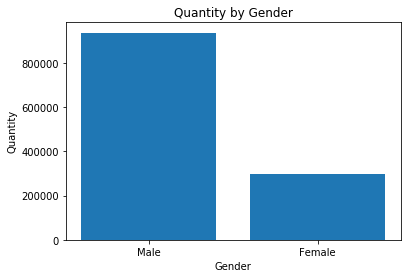
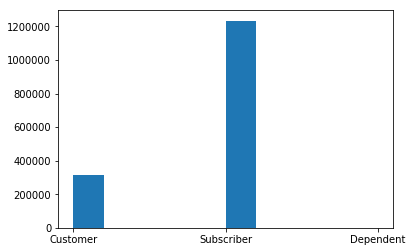

# Project 01 - Explore Chicago Bikeshare Data

#### Tags
* Title: Project 01 - Explore Chicago Bikeshare Data
* Author: AH Uyekita
* Course: Data Science - Foundation 01
* Date: 08/12/2018
* Cod: ND110
* Tags: Udacity, Data Science, Python

## Objectivies

This is my first `Jupyter Notebook`, so this is an opportunity to learn how this tool works. It's quite familiar with `RMarkdown` files.

My objectivies to this document:

* Pratice the Jupyter Notebook;
* Documentation of my project;
* Turn this document reproducible;
* Have fun.

## Synopsis

All this document is about the Project of the Nanodegree ND110 called Explore Chicago Bikeshare Data, but the real core of this project is to fill some chuncks of code in a skeleton/template of py file.


## Requirements

The code will use the UTF-8 encoding system, and the libraries to perform this project:


```python
# Here goes the imports
import csv
import matplotlib.pyplot as plt
```

The csv package is used to import a csv file (chicago.csv) and the matplotlib is applied to plot simple graphics.

### Environment

I have tested a bunch of softwares to run the python scripts, such as:

* Spider
* IDLE
* Git Bash

I have also used the CodeSkulptor to test minor things.

* [CodeSkulptor](https://py3.codeskulptor.org/).

Lastly, my all purpose `py` file editor is the Atom.

* Atom.

> Obs.: The best way I found out (in three days coding in Python) was: Atom + Git Bash. I'm sure I'll change it, but it good to point it out.

## Loading data


```python
# Let's read the data as a list
print("Reading the document...")
with open("chicago.csv", "r") as file_read:
    reader = csv.reader(file_read)
    data_list = list(reader)
print("Ok!")
```

    Reading the document...
    Ok!
    

## Some Analysis

Let's check the number of rows and the number of column.


```python
print("Number of rows:")
print(len(data_list))
print("Number of column:")
print(len(data_list[0]))
```

    Number of rows:
    1551506
    Number of column:
    8
    

Accordlying with the **Project Details** there are six (6) columns, but this is clearly a mistake. Now, let's print the first row of this dataset, which I expect the headers of the document:


```python
# Printing the first row of data_list to check if it worked.
print("Row 0: ")
print(data_list[0])
# It's the data header, so we can identify the columns.
```

    Row 0: 
    ['Start Time', 'End Time', 'Trip Duration', 'Start Station', 'End Station', 'User Type', 'Gender', 'Birth Year']
    

So, the data starts from the second line, let's take a look.


```python
# Printing the second row of data_list, it should contain some data
print("Row 1: ")
print(data_list[1])
```

    Row 1: 
    ['2017-01-01 00:00:36', '2017-01-01 00:06:32', '356', 'Canal St & Taylor St', 'Canal St & Monroe St (*)', 'Customer', '', '']
    

## Task

This `py` skeleton of script has twelve (12) chunks to be complete with code. I will describe each chunck with details (to remember in 6 months what I have done) in this project.

### Task 1

>TODO: Print the first 20 rows using a loop to identify the data.

**My solution:**
```
for i in range(0,20):
    print(data_list[i])
```
Each element of this list represent a single row of the dataset chicago.csv, for this reason, I just need to `print()` the first 20 rows using a `for()`, but I minded that Python is a _zero-index_ programming language. The `range()` functions allows me to iterate from 0 to 19 (the `range()` function has the first argument inclusive and the second argument exclusive).


```python
print("\n\nTASK 1: Printing the first 20 samples")

for i in range(0,20):   # The first 20 rows - The first row in the header and the other 19 rows were observations
    print(data_list[i]) # Printing

# Let's change the data_list to remove the header from it.
data_list = data_list[1:]

# We can access the features through index
# E.g. sample[6] to print gender or sample[-2]
```

    
    
    TASK 1: Printing the first 20 samples
    ['Start Time', 'End Time', 'Trip Duration', 'Start Station', 'End Station', 'User Type', 'Gender', 'Birth Year']
    ['2017-01-01 00:00:36', '2017-01-01 00:06:32', '356', 'Canal St & Taylor St', 'Canal St & Monroe St (*)', 'Customer', '', '']
    ['2017-01-01 00:02:54', '2017-01-01 00:08:21', '327', 'Larrabee St & Menomonee St', 'Sheffield Ave & Kingsbury St', 'Subscriber', 'Male', '1984.0']
    ['2017-01-01 00:06:06', '2017-01-01 00:18:31', '745', 'Orleans St & Chestnut St (NEXT Apts)', 'Ashland Ave & Blackhawk St', 'Subscriber', 'Male', '1985.0']
    ['2017-01-01 00:07:28', '2017-01-01 00:12:51', '323', 'Franklin St & Monroe St', 'Clinton St & Tilden St', 'Subscriber', 'Male', '1990.0']
    ['2017-01-01 00:07:57', '2017-01-01 00:20:53', '776', 'Broadway & Barry Ave', 'Sedgwick St & North Ave', 'Subscriber', 'Male', '1990.0']
    ['2017-01-01 00:10:44', '2017-01-01 00:21:27', '643', 'State St & Kinzie St', 'Wells St & Polk St', 'Subscriber', 'Male', '1970.0']
    ['2017-01-01 00:11:34', '2017-01-01 00:23:47', '733', 'Wabash Ave & Wacker Pl', 'Clinton St & Tilden St', 'Subscriber', 'Male', '1986.0']
    ['2017-01-01 00:14:57', '2017-01-01 00:26:22', '685', 'Daley Center Plaza', 'Canal St & Monroe St (*)', 'Customer', '', '']
    ['2017-01-01 00:15:03', '2017-01-01 00:26:28', '685', 'Daley Center Plaza', 'Canal St & Monroe St (*)', 'Customer', '', '']
    ['2017-01-01 00:17:01', '2017-01-01 00:29:49', '768', 'Dayton St & North Ave', 'Ogden Ave & Chicago Ave', 'Customer', '', '']
    ['2017-01-01 00:17:13', '2017-01-01 11:03:34', '38781', 'Wilton Ave & Diversey Pkwy', 'Halsted St & Wrightwood Ave', 'Subscriber', 'Female', '1988.0']
    ['2017-01-01 00:18:28', '2017-01-01 00:31:05', '757', 'Canal St & Madison St', 'LaSalle St & Illinois St', 'Customer', '', '']
    ['2017-01-01 00:18:50', '2017-01-01 00:21:47', '177', 'Theater on the Lake', 'Lakeview Ave & Fullerton Pkwy', 'Subscriber', 'Male', '1991.0']
    ['2017-01-01 00:23:41', '2017-01-01 00:29:13', '332', 'Halsted St & Maxwell St', 'Halsted St & 18th St', 'Subscriber', 'Male', '1984.0']
    ['2017-01-01 00:25:47', '2017-01-01 00:39:53', '846', 'Ravenswood Ave & Lawrence Ave', 'Clarendon Ave & Gordon Ter', 'Subscriber', 'Female', '1987.0']
    ['2017-01-01 00:25:47', '2017-01-01 00:43:23', '1056', 'Clark St & Congress Pkwy', 'Wolcott Ave & Polk St', 'Subscriber', 'Male', '1984.0']
    ['2017-01-01 00:26:21', '2017-01-01 00:39:40', '799', 'Ravenswood Ave & Lawrence Ave', 'Clarendon Ave & Gordon Ter', 'Subscriber', 'Male', '1987.0']
    ['2017-01-01 00:27:21', '2017-01-01 00:42:59', '938', 'Millennium Park', 'Michigan Ave & 18th St', 'Subscriber', 'Male', '1991.0']
    ['2017-01-01 00:27:28', '2017-01-01 00:42:44', '916', 'Millennium Park', 'Michigan Ave & 18th St', 'Subscriber', 'Female', '1990.0']
    

### Task 2

>TODO: Print the `gender` of the first 20 rows.

**My solution:**
```
for i in range(0,20):        # The first 20 rows
    print(data_list[i][6])   # Subsetting each row gathering the 7th element of this list and print
                             # I could also use data_list[i][-2]
```
All `list` are ordered and for this reason I can use the index to pick the exactly element inside of that list.


```python
print("\nTASK 2: Printing the genders of the first 20 samples")

for i in range(0,20):   # The first 20 rows
    print(data_list[i][6])

# Cool! We can get the rows(samples) iterating with a for and the columns(features) by index.
# But it's still hard to get a column in a list. Example: List with all genders
```

    
    TASK 2: Printing the genders of the first 20 samples
    
    Male
    Male
    Male
    Male
    Male
    Male
    
    
    
    Female
    
    Male
    Male
    Female
    Male
    Male
    Male
    Female
    Male
    

### Task 3

>TODO: Create a function to add the columns(features) of a list in another list in the same order

**My solution:**
```
def column_to_list(data, index):
    """
    -----------------------------------------------------------------------------------------------------
    |DESCRIPTION:                                                                                       |
    |                                                                                                   |
    |     This function selects a specific column (defined as index) of a data frame (here called       |
    |     as data, but probabily will be data_list).                                                    |
    |                                                                                                   |
    -----------------------------------------------------------------------------------------------------
    |INPUT:                                                                                             |
    |                                                                                                   |
    |     VARIABLE   TYPE   DESCRIPTION                                                                 |
    |                                                                                                   |
    |     data       list   The imported dataset of the Chicago Bikeshare, a 1551506 x 8 data frame     |
    |                       stored in a list.                                                           |
    |                                                                                                   |
    |     index      int    The desireable column to be selected.                                       |
    |                           0: Start Time                                                           |
    |                           1: End Time                                                             |
    |                           2: Trip Duration                                                        |
    |                           3: Start Station                                                        |
    |                           4: End Station                                                          |
    |                           5: User Type                                                            |
    |                           6: Gender                                                               |
    |                           7: Birth Year                                                           |
    |                                                                                                   |
    -----------------------------------------------------------------------------------------------------
    |OUTPUT:                                                                                            |
    |                                                                                                   |
    |     VARIABLE      TYPE   DESCRIPTION                                                              |
    |                                                                                                   |
    |     column_list   list   The Selected column from the data input.                                 |
    |                                                                                                   |
    -----------------------------------------------------------------------------------------------------
    """
    column_list = []
    # Tip: You can use a for to iterate over the samples, get the feature by index and append into a list
    for i in range(0,len(data)):
        column_list.append(data[i][index])
    return column_list
```
I followed the instruction and created a `for()` loop and for each element of the input called data I appended to the local variable column_list, which will be returned as output.


```python
def column_to_list(data, index):
    """
    -----------------------------------------------------------------------------------------------------
    |DESCRIPTION:                                                                                       |
    |                                                                                                   |
    |     This function selects a specific column (defined as index) of a data frame (here called       |
    |     as data, but probabily will be data_list).                                                    |
    |                                                                                                   |
    -----------------------------------------------------------------------------------------------------
    |INPUT:                                                                                             |
    |                                                                                                   |
    |     VARIABLE   TYPE   DESCRIPTION                                                                 |
    |                                                                                                   |
    |     data       list   The imported dataset of the Chicago Bikeshare, a 1551506 x 8 data frame     |
    |                       stored in a list.                                                           |
    |                                                                                                   |
    |     index      int    The desireable column to be selected.                                       |
    |                           0: Start Time                                                           |
    |                           1: End Time                                                             |
    |                           2: Trip Duration                                                        |
    |                           3: Start Station                                                        |
    |                           4: End Station                                                          |
    |                           5: User Type                                                            |
    |                           6: Gender                                                               |
    |                           7: Birth Year                                                           |
    |                                                                                                   |
    -----------------------------------------------------------------------------------------------------
    |OUTPUT:                                                                                            |
    |                                                                                                   |
    |     VARIABLE      TYPE   DESCRIPTION                                                              |
    |                                                                                                   |
    |     column_list   list   The Selected column from the data input.                                 |
    |                                                                                                   |
    -----------------------------------------------------------------------------------------------------
    """
    column_list = []
    # Tip: You can use a for to iterate over the samples, get the feature by index and append into a list
    for i in range(0,len(data)):
        column_list.append(data[i][index])
    return column_list


# Let's check with the genders if it's working (only the first 20)
print("\nTASK 3: Printing the list of genders of the first 20 samples")
print(column_to_list(data_list, -2)[:20])
```

    
    TASK 3: Printing the list of genders of the first 20 samples
    ['', 'Male', 'Male', 'Male', 'Male', 'Male', 'Male', '', '', '', 'Female', '', 'Male', 'Male', 'Female', 'Male', 'Male', 'Male', 'Female', 'Male']
    

### Task 4

>TODO: Count each gender. You should not use a function to do that.

**My solution:**
```
gender = column_to_list(data_list, -2) # Selecting the Gender's column of data_list dataframe.

# Lambda Expressions
is_male = lambda x : x == "Male"     # Check each how if the statment is True or False. Later I will coerce
is_female = lambda x : x == "Female" # True to 1 and False to 0 to count the number of each category.
is_blank = lambda x : x == ""        # I used the plt.hist(gender) function to find out the categories of
                                     # Gender's column.

male = sum(list(map(is_male, gender)))        # Applying map() (for each column) and lambdas functions
female = sum(list(map(is_female, gender)))    # I could count the number of each category. 
undefined = sum(list(map(is_blank, gender)))  # Obs.: I "coerced" boolean to integer by the using of sum().
```
I figure out how to use the functions `map()` and the new concept learnt called _lambda expression_, binding these two concepts I realized I could you those two together in a very straightforward way.

* Lambda expressions to evaluate a simple statement (equal to "Male");
* `map()` to apply the lambda expression in all elements of a given list;
* "Coercing" the boolean values to `int` and later summing the values.

Keep in mind that there are 3 categories to gender variable:

* Male
* Female
* Blank

I have check this using the `set()` function to select the unique values of gender.
```
print(set(gender)) # Print the unique values/categories of gender
```


```python
gender = column_to_list(data_list, -2) # Selecting the Gender's column of data_list dataframe.

# Lambda Expressions
is_male = lambda x : x == "Male"     # Check each how if the statment is True or False. Later I will coerce
is_female = lambda x : x == "Female" # True to 1 and False to 0 to count the number of each category.
is_blank = lambda x : x == ""        # I used the plt.hist(gender) function to find out the categories of
                                     # Gender's column.

male = sum(list(map(is_male, gender)))        # Applying map() (for each column) and lambdas functions
female = sum(list(map(is_female, gender)))    # I could count the number of each category. 
undefined = sum(list(map(is_blank, gender)))  # Obs.: I "coerced" boolean to integer by the using of sum().

# Checking the result
print("\nTASK 4: Printing how many males and females we found")
print("Male: ", male, "\nFemale: ", female)
```

    
    TASK 4: Printing how many males and females we found
    Male:  935854 
    Female:  298784
    

### Task 5

> TODO: Create a function to count the genders. Return a list

> Should return a list with [count_male, counf_female] (e.g., [10, 15] means 10 Males, 15 Females)

**My solution:**
```
def count_gender(data_list):
    """
    -----------------------------------------------------------------------------------------------------
    |DESCRIPTION:                                                                                       |
    |                                                                                                   |
    |     This function counts the number of "Male" and "Female" from the Gender column of the          |
    |     data_list. This is a specific function to be used only to the purpose to calculated the       |
    |     quantity of "Male" and "Female".                                                              |
    |                                                                                                   |
    -----------------------------------------------------------------------------------------------------
    |INPUT:                                                                                             |
    |                                                                                                   |
    |     VARIABLE   TYPE   DESCRIPTION                                                                 |
    |                                                                                                   |
    |     data_list  list   The list generated after the .read() process. The original file was the     |
    |                       chicago.csv, which has a 1551506 rows and 8 columns.                        |
    |                                                                                                   |
    -----------------------------------------------------------------------------------------------------
    |OUTPUT:                                                                                            |
    |                                                                                                   |
    |     VARIABLE         TYPE   DESCRIPTION                                                           |
    |                                                                                                   |
    |     [male,female]    list   A list of two variables, the first one summarize the number of "Male" |
    |                             the second one summarize the number of "Female".                      |
    |                                                                                                   |
    -----------------------------------------------------------------------------------------------------
    |REQUIREMENT:                                                                                       |
    |                                                                                                   |
    |     NAME             SCOPE                                                                        |
    |                                                                                                   |
    |     column_to_list   Global                                                                       |
    |                                                                                                   |
    -----------------------------------------------------------------------------------------------------    
    """
    # Selecting the Gender's column as a local variable.
    local_gender = column_to_list(data_list, -2) # Keep in mind this function has defined in the Task 3.
    
    # Based on the map() to find True or False and sum() to count.
    male = sum(list(map(lambda x : x == "Male", local_gender)))     # Simplified version, now with one step less
    female = sum(list(map(lambda x : x == "Female", local_gender))) # It's a bit clumsy but understandable.
    
    return [male, female] # Return of the total number of male and female.

```
Unfortunately, this function is not a all purpose because it is tailored to work only with the gender column. Take a look to the "Male" and "Female" strings defined in the code.


```python
def count_gender(data_list):
    """
    -----------------------------------------------------------------------------------------------------
    |DESCRIPTION:                                                                                       |
    |                                                                                                   |
    |     This function counts the number of "Male" and "Female" from the Gender column of the          |
    |     data_list. This is a specific function to be used only to the purpose to calculated the       |
    |     quantity of "Male" and "Female".                                                              |
    |                                                                                                   |
    -----------------------------------------------------------------------------------------------------
    |INPUT:                                                                                             |
    |                                                                                                   |
    |     VARIABLE   TYPE   DESCRIPTION                                                                 |
    |                                                                                                   |
    |     data_list  list   The list generated after the .read() process. The original file was the     |
    |                       chicago.csv, which has a 1551506 rows and 8 columns.                        |
    |                                                                                                   |                                                                                                   |
    -----------------------------------------------------------------------------------------------------
    |OUTPUT:                                                                                            |
    |                                                                                                   |
    |     VARIABLE         TYPE   DESCRIPTION                                                           |
    |                                                                                                   |
    |     [male,female]    list   A list of two variables, the first one summarize the number of "Male" |
    |                             the second one summarize the number of "Female".                      |
    |                                                                                                   |
    -----------------------------------------------------------------------------------------------------
    |REQUIREMENT:                                                                                       |
    |                                                                                                   |
    |     NAME             SCOPE                                                                        |
    |                                                                                                   |
    |     column_to_list   Global                                                                       |
    |                                                                                                   |
    -----------------------------------------------------------------------------------------------------    
    """
    # Selecting the Gender's column as a local variable.
    local_gender = column_to_list(data_list, -2) # Keep in mind this function has defined in the Task 3.
    
    # Based on the map() to find True or False and sum() to count.
    male = sum(list(map(lambda x : x == "Male", local_gender)))     # Simplified version, now with one step less
    female = sum(list(map(lambda x : x == "Female", local_gender))) # It's a bit clumsy but understandable.
    
    return [male, female] # Return of the total number of male and female.


print("\nTASK 5: Printing result of count_gender")
print(count_gender(data_list))
```

    
    TASK 5: Printing result of count_gender
    [935854, 298784]
    

### Task 6

>TODO: Create a function to get the most popular gender and print the gender as string.

> We expect to see "Male", "Female" or "Equal" as answer.

```
def most_popular_gender(data_list):
    """
    -----------------------------------------------------------------------------------------------------
    |DESCRIPTION:                                                                                       |
    |                                                                                                   |
    |     This function returns which Gender has the majority of in case of the same number returned    |
    |     Equal                                                                                         |
    |                                                                                                   |
    -----------------------------------------------------------------------------------------------------
    |INPUT:                                                                                             |
    |                                                                                                   |
    |     VARIABLE   TYPE   DESCRIPTION                                                                 |
    |                                                                                                   |
    |     data_list  list   The list generated after the .read() process. The original file was the     |
    |                       chicago.csv, which has a 1551506 rows and 8 columns.                        |
    |                                                                                                   |
    -----------------------------------------------------------------------------------------------------
    |OUTPUT:                                                                                            |
    |                                                                                                   |
    |     VARIABLE   TYPE   DESCRIPTION                                                                 |
    |                                                                                                   |
    |     answer     str    If the number of "Name" are greater than "Female" return "Male". If the     |
    |                       opposite was true returns "Female". In cases of draw return "Equal".        |
    |                                                                                                   |
    -----------------------------------------------------------------------------------------------------
    |REQUIREMENT:                                                                                       |
    |                                                                                                   |
    |     NAME             SCOPE                                                                        |
    |                                                                                                   |
    |     count_gender     Global                                                                       |
    |                                                                                                   |
    ----------------------------------------------------------------------------------------------------- 
    """
    # Number of Male and Female calculationg
    local_gender_total = count_gender(data_list) # local_gender_total[0] : Male
                                                 # local_gender_total[1] : Female

    if local_gender_total[0] > local_gender_total[1]:    # Is Male > Female?
        answer = "Male"                                  # If True update answer
        
    elif local_gender_total[0] == local_gender_total[1]: # Is Male == Female?
        answer = "Equal"                                 # If True update answer
        
    else:                                                # Is Female > Male
        answer = "Female"                                # If True update answer
        
    return answer # Return the answer
```
This is an conditional statement function that will return which gender has the majority.


```python
def most_popular_gender(data_list):
    """
    -----------------------------------------------------------------------------------------------------
    |DESCRIPTION:                                                                                       |
    |                                                                                                   |
    |     This function returns which Gender has the majority of in case of the same number returned    |
    |     Equal                                                                                         |
    |                                                                                                   |
    -----------------------------------------------------------------------------------------------------
    |INPUT:                                                                                             |
    |                                                                                                   |
    |     VARIABLE   TYPE   DESCRIPTION                                                                 |
    |                                                                                                   |
    |     data_list  list   The list generated after the .read() process. The original file was the     |
    |                       chicago.csv, which has a 1551506 rows and 8 columns.                        |
    |                                                                                                   |
    -----------------------------------------------------------------------------------------------------
    |OUTPUT:                                                                                            |
    |                                                                                                   |
    |     VARIABLE   TYPE   DESCRIPTION                                                                 |
    |                                                                                                   |
    |     answer     str    If the number of "Name" are greater than "Female" return "Male". If the     |
    |                       opposite was true returns "Female". In cases of draw return "Equal".        |
    |                                                                                                   |
    -----------------------------------------------------------------------------------------------------
    |REQUIREMENT:                                                                                       |
    |                                                                                                   |
    |     NAME             SCOPE                                                                        |
    |                                                                                                   |
    |     count_gender     Global                                                                       |
    |                                                                                                   |
    ----------------------------------------------------------------------------------------------------- 
    """
    # Number of Male and Female calculationg
    local_gender_total = count_gender(data_list) # local_gender_total[0] : Male
                                                 # local_gender_total[1] : Female

    if local_gender_total[0] > local_gender_total[1]:    # Is Male > Female?
        answer = "Male"                                  # If True update answer
        
    elif local_gender_total[0] == local_gender_total[1]: # Is Male == Female?
        answer = "Equal"                                 # If True update answer
        
    else:                                                # Is Female > Male
        answer = "Female"                                # If True update answer
        
    return answer # Return the answer

print("\nTASK 6: Which one is the most popular gender?")
print("Most popular gender is: ", most_popular_gender(data_list))
```

    
    TASK 6: Which one is the most popular gender?
    Most popular gender is:  Male
    

If it's everything running as expected, check this graph!


```python
gender_list = column_to_list(data_list, -2)
types = ["Male", "Female"]
quantity = count_gender(data_list)
y_pos = list(range(len(types)))
plt.bar(y_pos, quantity)
plt.ylabel('Quantity')
plt.xlabel('Gender')
plt.xticks(y_pos, types)
plt.title('Quantity by Gender')
plt.show(block=True)
```





### Task 7

>TODO: Plot a similar graph for user_types. Make sure the legend is correct.

```
# Selecting the desired column
user_types = column_to_list(data_list, -3)

# Selecting the uniques categories.
types = list(set(user_types))  # Three categories: Customer, Dependent and Subscriber

# Removing the "Dependent" as commented above
types = [sorted(types)[0], sorted(types)[-1]]

# Calculating the quantity of each of types ("Customer" and "Subscriber")
quantity = [sum(list(map(lambda x : x == types[0], user_types))),  # Due to the Task 5 requirements my function
            sum(list(map(lambda x : x == types[1], user_types)))]  # count_gender() is very specific and can not
                                                                   # deal with a generic situation like this.

# print(sum(list(map(lambda x : x == "Dependent", user_types)))) # Shows the number of Dependent category.

y_pos = list(range(len(types)))
plt.bar(y_pos, quantity)
plt.ylabel('Quantity')              # Add the y axis
plt.xlabel('User Types')            # Add the x axis
plt.xticks(y_pos, types)            # Remove x marks
plt.title('Quantity by User Types') # Add Title
plt.show(block=True) 
```

Explanation how I conducted this Task.

The print(set(user_types)) give me {'Customer', 'Subscriber', 'Dependent'}, it means the dataframe has 3 categories, but with a deeper analisys using a straighfoward plot (`plt.hist()`) shows me the "Dependent" are exceptions, only 4 instances of this category. For this reason, I removed from the graphic because it is not a valueable information faced the number of "Customer" and "Subscriber".

If my point of view is not correct, please, let me know. I can fix it and resubmit you as soon as possible.


```python
# Number of categories of gender column
print(set(user_types)) # Print the set()
```


    ---------------------------------------------------------------------------

    NameError                                 Traceback (most recent call last)

    <ipython-input-13-4a23e9e64155> in <module>()
          1 # Number of categories of gender column
    ----> 2 print(set(user_types)) # Print the set()
    

    NameError: name 'user_types' is not defined


```python
user_types = column_to_list(data_list, -3)
plt.hist(user_types)
```


    (array([3.171620e+05, 0.000000e+00, 0.000000e+00, 0.000000e+00,
            0.000000e+00, 1.234339e+06, 0.000000e+00, 0.000000e+00,
            0.000000e+00, 4.000000e+00]),
     array([0. , 0.2, 0.4, 0.6, 0.8, 1. , 1.2, 1.4, 1.6, 1.8, 2. ]),
     <a list of 10 Patch objects>)





```python
print("\nTASK 7: Check the chart!")

# Selecting the desired column
user_types = column_to_list(data_list, -3)

# Selecting the uniques categories.
types = list(set(user_types))  # Three categories: Customer, Dependent and Subscriber

# Removing the "Dependent" as commented above
types = [sorted(types)[0], sorted(types)[-1]]

# Calculating the quantity of each of types ("Customer" and "Subscriber")
quantity = [sum(list(map(lambda x : x == types[0], user_types))),  # Due to the Task 5 requirements my function
            sum(list(map(lambda x : x == types[1], user_types)))]  # count_gender() is very specific and can not
                                                                   # deal with a generic situation like this.

# print(sum(list(map(lambda x : x == "Dependent", user_types)))) # Shows the number of Dependent category.

y_pos = list(range(len(types)))
plt.bar(y_pos, quantity)
plt.ylabel('Quantity')              # Add the y axis
plt.xlabel('User Types')            # Add the x axis
plt.xticks(y_pos, types)            # Remove x marks
plt.title('Quantity by User Types') # Add Title
plt.show(block=True) 
```

    
    TASK 7: Check the chart!
    


### Task 8

>TODO: Answer the following question
```
male, female = count_gender(data_list)
print("\nTASK 8: Why the following condition is False?")
print("male + female == len(data_list):", male + female == len(data_list))

answer = "There are many rows with blank values in gender's column. Exactly {} rows with no values (blank)."

print("Answer:", answer.format(undefined)) # undefined was calculated in Task 4.
```
The summation of "Male" and "Female" number is not equal to the number of rows because there are some rows with blank value to the gender. I have already calculated the number of blanks rows in gender column.


```python
male, female = count_gender(data_list)
print("\nTASK 8: Why the following condition is False?")
print("male + female == len(data_list):", male + female == len(data_list))

answer = "There are many rows with blank values in gender's column. Exactly {} rows with no values (blank)."

print("Answer:", answer.format(undefined)) # undefined was calculated in Task 4.

```

    
    TASK 8: Why the following condition is False?
    male + female == len(data_list): False
    Answer: There are many rows with blank values in gender's column. Exactly 316867 rows with no values (blank).
    

Let's work with the trip_duration now. We cant get some values from it.

### Task 9
>TODO: Find the Minimum, Maximum, Mean and Median trip duration.
>You should not use ready functions to do that, like max() or min().

```
# Selecting the column of trip duration
trip_duration_list = column_to_list(data_list, 2)

# Defining a lambda expression to coerce str variables to float
conv_to_float = lambda x : float(x) # This is very handy!!

# Converting the elements of trip_duration_list to float
trip_dur_float = list(map(conv_to_float, trip_duration_list))

# Minimum
min_trip = round(sorted(trip_dur_float)[0]) # Could I use .sorted()?

# Maximum
max_trip = round(sorted(trip_dur_float, reverse = True)[0]) # Could I use .sorted()?

# Mean
mean_trip = round(sum(trip_dur_float)/len(trip_dur_float)) # Could I use sum()?

# Median
median_trip = round(sorted(trip_dur_float)[int(len(trip_dur_float)/2)]) # Could I use .sorted()?

# If the use of these built-in function or methods (.sorted(), sum() etc.) is not allowed, I could resubmit the project
# and I will fix it using a loop approach or any other way to calculate those parameters.

print("\nTASK 9: Printing the min, max, mean and median")
print("Min: ", min_trip, "Max: ", max_trip, "Mean: ", mean_trip, "Median: ", median_trip)
```

To be honest, I really do not know what is inside of this set of "ready functions". However, I have tried to do an effort to accomplish this task using different ways rather than a simple built-in function.

If the use of these built-in function or methods (.sorted(), sum() etc.) is not allowed, I could resubmit the project and I will fix it using a loop approach or any other way to calculate those parameters.


```python
# Selecting the column of trip duration
trip_duration_list = column_to_list(data_list, 2)

# Defining a lambda expression to coerce str variables to float
conv_to_float = lambda x : float(x) # This is very handy!!

# Converting the elements of trip_duration_list to float
trip_dur_float = list(map(conv_to_float, trip_duration_list))

# Minimum
min_trip = round(sorted(trip_dur_float)[0]) # Could I use .sorted()?

# Maximum
max_trip = round(sorted(trip_dur_float, reverse = True)[0]) # Could I use .sorted()?

# Mean
mean_trip = round(sum(trip_dur_float)/len(trip_dur_float)) # Could I use sum()?

# Median
median_trip = round(sorted(trip_dur_float)[int(len(trip_dur_float)/2)]) # Could I use .sorted()?

print("\nTASK 9: Printing the min, max, mean and median")
print("Min: ", min_trip, "Max: ", max_trip, "Mean: ", mean_trip, "Median: ", median_trip)
```

    
    TASK 9: Printing the min, max, mean and median
    Min:  60 Max:  86338 Mean:  940 Median:  670
    

### Task 10

>Gender is easy because usually only have a few options. How about start_stations? How many options does it have?

>TODO: Check types how many start_stations do we have using set()


```python
user_types = set() # Unique elements

# Selecting the column of Start Stations from data_list
start_stations = column_to_list(data_list, 3)

# First 20 rows to an analysis
# start_stations[0:20]

# Selecting the unique elements of start_stations list.
user_types = list(set(start_stations))

print("\nTASK 10: Printing start stations:")
print(len(user_types))
print(user_types)
```

    
    TASK 10: Printing start stations:
    582
    ['Halsted St & Blackhawk St (*)', 'Blue Island Ave & 18th St', 'Millennium Park', 'Indiana Ave & 31st St', 'Central St & Girard Ave', 'Clark St & Wrightwood Ave', 'Racine Ave & Randolph St', '63rd St Beach', 'State St & 79th St', 'Halsted St & Polk St', 'Ravenswood Ave & Lawrence Ave', 'Damen Ave & Cullerton St', 'Broadway & Granville Ave', 'Western Ave & Congress Pkwy', 'Broadway & Belmont Ave', 'Elizabeth St & 47th St', 'Broadway & Ridge Ave', 'Broadway & Wilson Ave', 'McCormick Place', 'Ada St & Washington Blvd', 'Clark St & Grace St', 'Sheffield Ave & Webster Ave', 'Lincoln Ave & Leavitt St', 'Dearborn Pkwy & Delaware Pl', 'Greenview Ave & Fullerton Ave', 'Drake Ave & Montrose Ave', 'Winchester Ave & Elston Ave', 'Normal Ave & Archer Ave', 'Southport Ave & Wellington Ave', 'Rockwell St & Eastwood Ave', 'Loomis St & Taylor St (*)', 'Glenwood Ave & Morse Ave', 'Western Blvd & 48th Pl', 'Halsted St & Roscoe St', 'Morgan St & 18th St', 'Clinton St & 18th St', 'Seeley Ave & Roscoe St', 'Leavitt St & Lawrence Ave', 'Sheridan Rd & Greenleaf Ave', 'Kingsbury St & Kinzie St', 'Ravenswood Ave & Balmoral Ave', 'Woodlawn Ave & 55th St', 'Loomis St & Lexington St', 'Pulaski Rd & Eddy St', 'Desplaines St & Kinzie St', 'Austin Blvd & Chicago Ave', 'Damen Ave & 51st St', 'Racine Ave & Fullerton Ave', 'Clark St & Jarvis Ave', 'Wells St & Evergreen Ave', 'California Ave & Cortez St', 'Kingsbury St & Erie St', 'Marshfield Ave & 44th St', 'Central Park Blvd & 5th Ave', 'MLK Jr Dr & 47th St', 'Franklin St & Quincy St', 'California Ave & Fletcher St', 'Broadway & Waveland Ave', 'Kimbark Ave & 53rd St', 'Wilton Ave & Diversey Pkwy', 'State St & 33rd St', 'Greenwood Ave & 47th St', 'Halsted St & Maxwell St', 'Lincoln Ave & Addison St', 'Halsted St & 56th St', 'Rhodes Ave & 32nd St', 'Damen Ave & Sunnyside Ave', 'Dodge Ave & Church St', 'Canal St & Adams St', 'Michigan Ave & Congress Pkwy', 'Western Ave & Granville Ave', 'Eastlake Ter & Rogers Ave', 'Damen Ave & Coulter St', 'LaSalle St & Adams St', 'Noble St & Milwaukee Ave', 'Ashland Ave & Augusta Blvd', 'LaSalle St & Jackson Blvd', 'Ashland Ave & Chicago Ave', 'Chicago Ave & Sheridan Rd', 'Monticello Ave & Irving Park Rd', 'Perry Ave & 69th St', 'Wabash Ave & Grand Ave', 'Lincoln Ave & Diversey Pkwy', 'Theater on the Lake', 'California Ave & Montrose Ave', 'Halsted St & Roosevelt Rd', 'Kedzie Ave & Roosevelt Rd', 'Clark St & Bryn Mawr Ave', 'East Ave & Madison St', 'Clinton St & Lake St', 'Seeley Ave & Garfield Blvd', 'Ashland Ave & 63rd St', 'Michigan Ave & Pearson St', 'Wells St & 19th St', 'Rush St & Superior St', 'State St & Pearson St', 'Kilbourn Ave & Milwaukee Ave', 'Lake Shore Dr & Ohio St', 'Ridge Blvd & Howard St', 'State St & Van Buren St', 'Hermitage Ave & Polk St', 'Stockton Dr & Wrightwood Ave', 'Damen Ave & Cortland St', 'Southport Ave & Irving Park Rd', 'Cottage Grove Ave & 51st St', 'Clark St & Lake St', 'McClurg Ct & Erie St', 'Western Ave & Lunt Ave', 'Jeffery Blvd & 67th St', 'Ellis Ave & 53rd St', 'California Ave & Lake St', 'Western Ave & Winnebago Ave', 'MLK Jr Dr & 56th St (*)', 'Campbell Ave & Fullerton Ave', 'Warren Park West', 'Kedzie Ave & Milwaukee Ave', 'Lake Shore Dr & Diversey Pkwy', 'Central Ave & Lake St', 'State St & 76th St', 'Elston Ave & Wabansia Ave', 'Valli Produce - Evanston Plaza', 'Lakefront Trail & Bryn Mawr Ave', 'Glenwood Ave & Touhy Ave', 'Racine Ave & Belmont Ave', 'California Ave & 23rd Pl', 'Damen Ave & Clybourn Ave', 'Damen Ave & Grand Ave', 'Princeton Ave & Garfield Blvd', 'Kimball Ave & Belmont Ave', 'Wells St & Concord Ln', 'Emerald Ave & 28th St', 'Calumet Ave & 35th St', 'Halsted St & 63rd St', 'Ashland Ave & Division St', 'Dearborn St & Erie St', 'Sheffield Ave & Wellington Ave', 'Laramie Ave & Gladys Ave', 'Ashland Ave & Wrightwood Ave', 'Southport Ave & Waveland Ave', 'Cottage Grove Ave & 83rd St', 'California Ave & Altgeld St', 'Oakley Ave & Touhy Ave', 'Ashland Ave & Pershing Rd', 'Halsted St & 59th St', 'State St & Pershing Rd', 'Prairie Ave & Garfield Blvd', '2112 W Peterson Ave', 'Lincoln Ave & Waveland Ave', 'Shields Ave & 28th Pl', 'Clarendon Ave & Gordon Ter', 'Kedzie Ave & Chicago Ave', 'Clinton St & Madison St', 'Greenview Ave & Diversey Pkwy', 'Marion St & South Blvd', 'Clinton St & Washington Blvd', 'Michigan Ave & Jackson Blvd', 'State St & 35th St', 'Leavitt St & Archer Ave', 'Michigan Ave & 18th St', 'Indiana Ave & 26th St', 'Ogden Ave & Congress Pkwy', 'Wabash Ave & 16th St', 'Ashland Ave & Garfield Blvd', 'Carpenter St & Huron St', 'Columbus Dr & Randolph St', 'Clarendon Ave & Junior Ter', 'Larrabee St & North Ave', 'Damen Ave & Augusta Blvd', 'Talman Ave & Addison St', 'Spaulding Ave & Division St', 'Damen Ave & Chicago Ave', 'Sheffield Ave & Fullerton Ave', 'Clark St & Leland Ave', 'May St & Cullerton St', 'Michigan Ave & Lake St', 'Ashland Ave & 69th St', 'Mason Ave & Madison St', 'Damen Ave & Pershing Rd', 'Leavitt St & Armitage Ave', 'Pulaski Rd & Congress Pkwy', 'Halsted St & Diversey Pkwy', 'Lincoln Ave & Roscoe St', 'Austin Blvd & Lake St', 'Southport Ave & Clark St', 'California Ave & Division St', 'Western Ave & Monroe St', 'Clinton St & Jackson Blvd', 'Wentworth Ave & 63rd St', 'Wolcott Ave & Polk St', 'Broadway & Cornelia Ave', 'Milwaukee Ave & Grand Ave', 'State St & Harrison St', 'Franklin St & Chicago Ave', 'Lincoln Ave & Belmont Ave', 'Michigan Ave & Oak St', 'May St & 69th St', 'Damen Ave & Melrose Ave', 'Dearborn St & Monroe St', 'Adler Planetarium', 'Princeton Ave & 47th St', 'Sedgwick St & Webster Ave', 'Orleans St & Merchandise Mart Plaza', 'Racine Ave & Congress Pkwy', 'Lake Park Ave & 56th St', 'Washtenaw Ave & Lawrence Ave', 'Kedzie Ave & Lake St', 'Prairie Ave & 43rd St', 'Avers Ave & Belmont Ave', 'Halsted St & 47th Pl', 'Eckhart Park', 'Clark St & Schiller St', 'Phillips Ave & 82nd St', 'Wells St & Huron St', 'Clifton Ave & Armitage Ave', 'Avondale Ave & Irving Park Rd', 'Broadway & Argyle St', 'Sheffield Ave & Wrightwood Ave', 'Damen Ave & Charleston St', 'Lake Shore Dr & North Blvd', 'Central Ave & Madison St', 'Lake Shore Dr & Wellington Ave', 'Troy St & Elston Ave', 'Benson Ave & Church St', 'Morgan St & Lake St', 'Clark St & Berwyn Ave', 'Broadway & Berwyn Ave', 'Orleans St & Ohio St', 'Halsted St & Archer Ave', 'Buckingham Fountain', 'Ridgeland Ave & Lake St', 'Bissell St & Armitage Ave', 'Clark St & Elm St', 'Stony Island Ave & 82nd St', 'Leavitt St & North Ave', 'Normal Ave & 72nd St', 'Indiana Ave & 40th St', 'Sedgwick St & Schiller St', 'Union Ave & Root St', 'Larrabee St & Division St', 'Kedzie Ave & Foster Ave', 'Eberhart Ave & 61st St', 'Clark St & Chicago Ave', 'Albany Ave & 26th St', 'Clinton St & Tilden St', 'Sheridan Rd & Montrose Ave', 'Halsted St & Willow St', 'Racine Ave & 18th St', 'Troy St & North Ave', 'Ashland Ave & Belle Plaine Ave', 'Western Ave & Leland Ave', 'Kostner Ave & Lake St', 'Campbell Ave & Montrose Ave', 'Morgan Ave & 14th Pl', 'Michigan Ave & Madison St', 'Lincoln Ave & Winona St', 'South Shore Dr & 67th St', 'State St & Kinzie St', 'Clark St & North Ave', 'Stave St & Armitage Ave', 'Hoyne Ave & 47th St', 'Dorchester Ave & 49th St', 'Halsted St & 37th St', 'Ellis Ave & 83rd St', 'Morgan St & 31st St', 'Western Ave & 28th St', 'Stony Island Ave & South Chicago Ave', 'Throop St & 52nd St', 'Clarendon Ave & Leland Ave', 'Laramie Ave & Kinzie St', 'Manor Ave & Leland Ave', 'Evans Ave & 75th St', 'Jeffery Blvd & 71st St', 'Paulina Ave & North Ave', 'Cottage Grove Ave & 78th St', 'Lombard Ave & Madison St', 'Conservatory Dr & Lake St', 'Milwaukee Ave & Cuyler Ave', 'Clark St & 9th St (AMLI)', 'Michigan Ave & Washington St', 'Clifton Ave & Lawrence Ave', 'Ravenswood Ave & Irving Park Rd', 'Canal St & Monroe St (*)', 'Montrose Harbor', 'Wabash Ave & Adams St', 'Albany Ave & Bloomingdale Ave', 'Lombard Ave & Garfield St', 'Laramie Ave & Madison St', 'Canal St & Harrison St', 'Wells St & Polk St', 'Calumet Ave & 18th St', 'Clark St & Touhy Ave', 'Sacramento Blvd & Franklin Blvd', 'Artesian Ave & Hubbard St', 'Paulina St & Howard St', 'Larrabee St & Armitage Ave', 'Sedgwick St & North Ave', 'Green St & Madison St', 'Wood St & Hubbard St', 'Chicago Ave & Washington St', 'Sheridan Rd & Lawrence Ave', 'Broadway & Thorndale Ave', 'Drake Ave & Addison St', 'Clark St & Lunt Ave', 'Federal St & Polk St', 'Clark St & Congress Pkwy', 'Knox Ave & Montrose Ave', 'Ogden Ave & Chicago Ave', 'Fort Dearborn Dr & 31st St', 'Aberdeen St & Monroe St', 'Kosciuszko Park', 'Harper Ave & 59th St', 'Canal St & Taylor St', 'Commercial Ave & 83rd St', 'Halsted St & 51st St', 'Wood St & Division St', 'St. Clair St & Erie St', 'Larrabee St & Webster Ave', 'Morgan St & Polk St', 'Woodlawn Ave & 75th St', 'Clark St & Randolph St', 'Ashland Ave & 13th St', 'Kedzie Ave & Palmer Ct', 'Peoria St & Jackson Blvd', 'Cuyler Ave & Augusta St', 'Sedgwick St & Huron St', 'Milwaukee Ave & Rockwell St', 'Clinton St & Polk St (*)', 'Ogden Ave & Roosevelt Rd', 'Kedzie Ave & Harrison St', 'Racine Ave & 35th St', 'Humboldt Blvd & Armitage Ave', 'Racine Ave & 61st St', 'Lake Shore Dr & Belmont Ave', 'Wells St & Walton St', 'Southport Ave & Roscoe St', 'Damen Ave & Madison St', 'Southport Ave & Clybourn Ave', 'MLK Jr Dr & 83rd St', 'State St & Randolph St', 'Cottage Grove Ave & 71st St', 'Marshfield Ave & Cortland St', 'Leavitt St & Addison St', 'Wabash Ave & 8th St', 'Wabash Ave & Cermak Rd', 'Kedzie Ave & 24th St', 'Pulaski Rd & Madison St', 'Wentworth Ave & Archer Ave', 'Racine Ave (May St) & Fulton St', 'Sawyer Ave & Irving Park Rd', 'May St & Taylor St', 'Larrabee St & Kingsbury St', 'Fairbanks Ct & Grand Ave', 'Western Ave & 24th St', 'Jefferson St & Monroe St', 'Southport Ave & Belmont Ave', 'Western Ave & Division St', 'Wood St & 35th St', 'Loomis St & Archer Ave', 'Oakley Ave & Roscoe St', 'Ashland Ave & McDowell Ave', 'Ellis Ave & 60th St', 'Damen Ave & Division St', 'Financial Pl & Congress Pkwy', 'Rush St & Cedar St', 'Dorchester Ave & 63rd St', 'Pulaski Rd & Lake St', 'Calumet Ave & 33rd St', 'Ashland Ave & Harrison St', 'Pine Grove Ave & Irving Park Rd', 'Ashland Ave & Grace St', 'Dusable Harbor', 'Sangamon St & Washington Blvd (*)', 'Calumet Ave & 71st St', 'Cicero Ave & Quincy St', 'MLK Jr Dr & 29th St', 'Forest Ave & Lake St', 'Vernon Ave & 79th St', 'Rainbow Beach', 'Western Ave & 21st St', 'Clinton St & Roosevelt Rd', 'Ashland Ave & Lake St', 'Washtenaw Ave & 15th St (*)', 'Stony Island Ave & 64th St', 'Wentworth Ave & 35th St', 'Calumet Ave & 51st St', 'Damen Ave & Leland Ave', 'California Ave & Francis Pl', 'Bennett Ave & 79th St', 'Aberdeen St & Jackson Blvd', 'Green St & Randolph St', 'Wells St & Elm St', 'Desplaines St & Randolph St', 'Clark St & Wellington Ave', 'Central St Metra', 'Sheffield Ave & Waveland Ave', 'Exchange Ave & 79th St', 'Shore Dr & 55th St', 'State St & 29th St', 'Ellis Ave & 55th St', 'Wilton Ave & Belmont Ave', 'Larrabee St & Oak St', 'Cornell Ave & Hyde Park Blvd', 'Lake Shore Dr & Monroe St', 'Ridge Blvd & Touhy Ave', 'Cottage Grove Ave & 67th St', 'Shedd Aquarium', 'Warren Park East', 'Oak Park Ave & Harrison St', 'Wolcott Ave & Fargo Ave', 'Paulina St & 18th St', 'Elmwood Ave & Austin St', 'Cottage Grove Ave & Oakwood Blvd', 'Halsted St & North Branch St', 'MLK Jr Dr & 63rd St', 'Clark St & Montrose Ave', 'Albany (Kedzie) Ave & Montrose Ave', 'Wabash Ave & Wacker Pl', 'Central Park Ave & Elbridge Ave', 'Marine Dr & Ainslie St', 'Wisconsin Ave & Madison St', 'Wallace St & 35th St', 'University Library (NU)', 'Michigan Ave & 14th St', 'Wabash Ave & 87th St', 'Ellis Ave & 58th St', 'Burnham Harbor', 'Western Ave & Howard St', 'Desplaines St & Jackson Blvd', 'Sheridan Rd & Irving Park Rd', 'Franklin St & Lake St', 'Broadway & Sheridan Rd', 'Racine Ave & 65th St', 'Fairfield Ave & Roosevelt Rd', 'Racine Ave & Wrightwood Ave', 'Cottage Grove Ave & 47th St', 'Racine Ave & Garfield Blvd', 'Morgan St & Pershing Rd', 'Kostner Ave & Adams St', 'Calumet Ave & 21st St', 'Ashland Ave & 21st St', 'Ravenswood Ave & Berteau Ave', 'Lakeview Ave & Fullerton Pkwy', 'Racine Ave & 13th St', 'Western Ave & Walton St', 'California Ave & 21st St', 'Wentworth Ave & 24th St', 'Drake Ave & Fullerton Ave', 'Halsted St & 18th St', 'Wabash Ave & 83rd St', 'Orleans St & Elm St (*)', 'Paulina St & Montrose Ave', 'Sheffield Ave & Kingsbury St', 'Bosworth Ave & Howard St', 'Loomis St & Jackson Blvd', 'Francisco Ave & Foster Ave', 'Sheridan Rd & Loyola Ave', 'Kedzie Ave & Bryn Mawr Ave', 'McClurg Ct & Illinois St', 'Kedzie Ave & 21st St', 'Vernon Ave & 75th St', 'Ritchie Ct & Banks St', 'Racine Ave & 15th St', 'MLK Jr Dr & Oakwood Blvd', 'Cottage Grove Ave & 63rd St', 'Damen Ave & Pierce Ave', 'Spaulding Ave & Armitage Ave', 'Woodlawn Ave & Lake Park Ave', 'Halsted St & 35th St (*)', 'Larrabee St & Menomonee St', 'Damen Ave & Wellington Ave', 'Dearborn St & Adams St', 'Clark St & Elmdale Ave', 'Kilbourn Ave & Irving Park Rd', 'Wentworth Ave & 33rd St', 'Cityfront Plaza Dr & Pioneer Ct', 'Clybourn Ave & Division St', 'California Ave & North Ave', '900 W Harrison St', 'Marshfield Ave & 59th St', 'Daley Center Plaza', 'DuSable Museum', 'Lawndale Ave & 23rd St', 'Damen Ave & Foster Ave', 'Sheffield Ave & Willow St', 'LaSalle St & Illinois St', 'Lincoln Ave & Belle Plaine Ave', 'California Ave & Milwaukee Ave', 'Franklin St & Jackson Blvd', 'Orleans St & Chestnut St (NEXT Apts)', 'Mies van der Rohe Way & Chestnut St', 'Richmond St & Diversey Ave', 'Rush St & Hubbard St', 'South Shore Dr & 71st St', 'Greenwood Ave & 79th St', 'Halsted St & Dickens Ave', 'Streeter Dr & Grand Ave', 'Museum of Science and Industry', 'Pine Grove Ave & Waveland Ave', 'Humphrey Ave & Ontario St', 'Michigan Ave & 8th St', 'Dayton St & North Ave', 'Clark St & Lincoln Ave', 'Mies van der Rohe Way & Chicago Ave', 'Central Ave & Chicago Ave', 'California Ave & 26th St', 'Ashland Ave & Archer Ave', 'Keystone Ave & Montrose Ave', 'Field Museum', 'Oakley Ave & Irving Park Rd', 'East Ave & Garfield St', 'Ashland Ave & Blackhawk St', 'Wood St & Milwaukee Ave', 'Central Park Ave & Ogden Ave', 'Franklin St & Monroe St', 'Ashland Ave & 50th St', 'Milwaukee Ave & Wabansia Ave', 'California Ave & Byron St', 'Cannon Dr & Fullerton Ave', 'Clark St & Schreiber Ave', 'Lake Park Ave & 35th St', 'St. Louis Ave & Balmoral Ave', 'Cottage Grove Ave & 43rd St', 'State St & 19th St', 'Budlong Woods Library', 'Ravenswood Ave & Montrose Ave (*)', 'Forest Ave & Chicago Ave', 'Sheridan Rd & Noyes St (NU)', 'Cicero Ave & Flournoy St', 'Jeffery Blvd & 76th St', 'Hampden Ct & Diversey Pkwy', 'Clark St & Winnemac Ave', 'Maplewood Ave & Peterson Ave', 'Cicero Ave & Lake St', 'Kenton Ave & Madison St', 'Canal St & Madison St', 'Blackstone Ave & Hyde Park Blvd', 'Lincoln Ave & Fullerton Ave', 'Ogden Ave & Race Ave', 'Ashland Ave & Wellington Ave', 'Oak Park Ave & South Blvd', 'Keystone Ave & Fullerton Ave', 'University Ave & 57th St', 'Yates Blvd & 75th St', 'Lake Park Ave & 53rd St', 'Southport Ave & Wrightwood Ave', 'South Shore Dr & 74th St', 'Ashland Ave & 66th St', 'Lake Park Ave & 47th St', 'South Chicago Ave & 83rd St', 'Central Park Ave & North Ave', 'Stetson Ave & South Water St', 'Sheridan Rd & Buena Ave', 'Ashland Ave & Grand Ave', 'Phillips Ave & 79th St', 'Greenview Ave & Jarvis Ave', 'Kedzie Ave & Leland Ave', 'Clark St & Armitage Ave', 'Damen Ave & 59th St', 'Clark St & Columbia Ave', 'Halsted St & Wrightwood Ave', 'Millard Ave & 26th St', 'Wabash Ave & Roosevelt Rd', 'Emerald Ave & 31st St', 'Shields Ave & 31st St', 'Wood St & Taylor St', 'Saginaw Ave & Exchange Ave', 'Logan Blvd & Elston Ave', 'Wacker Dr & Washington St', 'LaSalle St & Washington St', 'Claremont Ave & Hirsch St', 'Christiana Ave & Lawrence Ave', 'Halsted St & 21st St', 'Broadway & Barry Ave', 'Shields Ave & 43rd St', 'Stony Island Ave & 75th St', 'Halsted St & 69th St', 'Field Blvd & South Water St', 'Stony Island Ave & 67th St', 'Campbell Ave & North Ave', 'Central Ave & Harrison St', 'Stony Island Ave & 71st St', 'Indiana Ave & Roosevelt Rd']
    

### Task 11
>Go back and make sure you documented your functions. Explain the input, output and what it do. Example:

>def new_function(param1: int, param2: str) -> list:

      """
      Example function with annotations.
      Args:
          param1: The first parameter.
          param2: The second parameter.
      Returns:
          List of X values

      """

### Task 12 - Challenge! (Optional)
>TODO: Create a function to count user types without hardcoding the types so we can use this function with a different kind of data.

```
def count_items(column_list):
    """
    -----------------------------------------------------------------------------------------------------
    |DESCRIPTION:                                                                                       |
    |                                                                                                   |
    |     This function returns which Gender has majority of in case of the same number returs Equal.   |
    |                                                                                                   |
    -----------------------------------------------------------------------------------------------------
    |INPUT:                                                                                             |
    |                                                                                                   |
    |     VARIABLE     TYPE   DESCRIPTION                                                               |
    |                                                                                                   |
    |     column_list  list   Is a list with only one variable, this is an output of column_to_list     |
    |                         function.                                                                 |
    |                                                                                                   |
    -----------------------------------------------------------------------------------------------------
    |OUTPUT:                                                                                            |
    |                                                                                                   |
    |     VARIABLE      TYPE   DESCRIPTION                                                              |
    |                                                                                                   |
    |     item_type     str    Returns all categories in the column_list.                               |
    |                                                                                                   |
    |     count_items   str    Returns the total of each category in item_type.                         |                                                                       |
    |                                                                                                   |
    -----------------------------------------------------------------------------------------------------
    """
    # Selecting unique elements from column_list
    item_types = list(set(column_list))
    
    # Initializing coun_items
    count_items = []
    
    # Loop to calculated the number each element from item_types
    for i in range(0,len(item_types)):
        count_items.append(sum(list(map(lambda x : x == item_types[i], column_list))))
        
    return item_types, count_items # Return two lists
```


```python
print("Will you face it?")
answer = "yes"

def count_items(column_list):
    """
    -----------------------------------------------------------------------------------------------------
    |DESCRIPTION:                                                                                       |
    |                                                                                                   |
    |     This function returns which Gender has majority of in case of the same number returs Equal.   |
    |                                                                                                   |
    -----------------------------------------------------------------------------------------------------
    |INPUT:                                                                                             |
    |                                                                                                   |
    |     VARIABLE     TYPE   DESCRIPTION                                                               |
    |                                                                                                   |
    |     column_list  list   Is a list with only one variable, this is an output of column_to_list     |
    |                         function.                                                                 |
    |                                                                                                   |
    -----------------------------------------------------------------------------------------------------
    |OUTPUT:                                                                                            |
    |                                                                                                   |
    |     VARIABLE      TYPE   DESCRIPTION                                                              |
    |                                                                                                   |
    |     item_type     str    Returns all categories in the column_list.                               |
    |                                                                                                   |
    |     count_items   str    Returns the total of each category in item_type.                         |                                                                       |
    |                                                                                                   |
    -----------------------------------------------------------------------------------------------------
    """
    # Selecting unique elements from column_list
    item_types = list(set(column_list))
    
    # Initializing coun_items
    count_items = []
    
    # Loop to calculated the number each element from item_types
    for i in range(0,len(item_types)):
        count_items.append(sum(list(map(lambda x : x == item_types[i], column_list))))
        
    return item_types, count_items # Return two lists
```

    Will you face it?
    


```python

if answer == "yes":
    # ------------ DO NOT CHANGE ANY CODE HERE ------------
    column_list = column_to_list(data_list, -2)
    types, counts = count_items(column_list)
    print("\nTASK 11: Printing results for count_items()")
    print("Types:", types, "Counts:", counts)
    assert len(types) == 3, "TASK 11: There are 3 types of gender!"
    assert sum(counts) == 1551505, "TASK 11: Returning wrong result!"
    # -----------------------------------------------------
```

    
    TASK 11: Printing results for count_items()
    Types: ['', 'Female', 'Male'] Counts: [316867, 298784, 935854]
    
